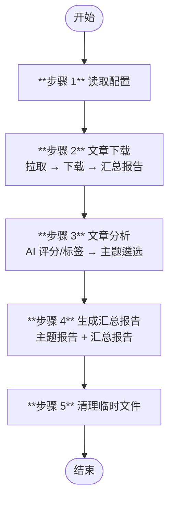

# 微信公众号文章抓取与报告生成 (wechat-mp-articles)

从配置的公众号抓取文章，经 AI 评分、标签提取与主题遴选，生成 Markdown 图文报告。

## 快速开始

准备配置文件（JSON），填入目标公众号信息，通过命令行参数传递给技能。结构示例：

```json
{
  "accounts": [
    {
      "name": "公众号名称",
      "fake_id": "公众号fake_id",
      "category": "分类标签",
      "enabled": true
    }
  ],
  "settings": {
    "name": "mp-articles",
    "days_to_filter": 3,
    "max_articles_per_account": 5,
    "topic_count": 3
  }
}
```

在 opencode 中输入触发指令，例如：
- "从配置的公众号抓取文章并生成报告"
- "拉取微信公众号最新文章汇总"

## 工作流



| 步骤 | 说明 | 产出 |
|------|------|------|
| 1 | 读取配置 | — |
| 2 | 拉取文章并下载为 Markdown | `{aid}_{date}_{account}_{title}.md` |
| 3 | AI 评分、标签提取与主题遴选 | `analysis_report.json` / `analysis_topic.json` |
| 4 | 生成主题报告与汇总报告 | `topic_*.md` / `summary_report.md` |
| 5 | 清理临时文件 | — |

## 注意事项

- 需要先配置 `wechat-mp-mcp` MCP 服务
- `fake_id` 通过 `wechat-mp-mcp_search_account(keyword="公众号名称")` 获取
- 内容校验失败最多重试 2 次，网络/IO 错误间隔 10s 重试最多 3 次
