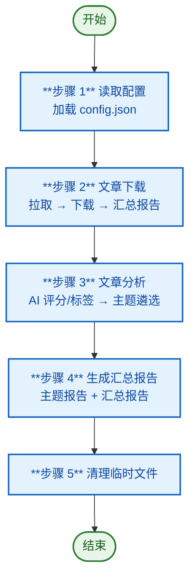

# 微信公众号文章抓取与报告生成

从配置的公众号抓取文章，按时间筛选后下载为 Markdown，经 AI 评分、标签提取与主题遴选，最终输出主题报告与汇总报告。全部由脚本驱动（Node.js），AI 仅用于内容理解和结构数据生成。

## 前置依赖

- `wechat-mp-mcp_get_article_list` — 根据 fake_ids 批量获取文章列表
- `download_articles.js` — 通过 HTTP API (`{PB_WECHAT_MP_API_BASE}/download`) 批量下载文章 Markdown 内容（替代 MCP 下载通道）

## 核心概念

| 概念 | 来源 | 说明 |
|------|------|------|
| **分类** `Category` | config.json 手工指定 | 公众号的组织标签，与最终主题无关 |
| **标签** `Tag` | AI 逐篇提取（步骤 3.1） | 每篇文章 2-5 个关键词 |
| **主题** `Topic` | AI 按算法遴选（步骤 3.2） | 综合标签频率 + 公众号覆盖数 + 平均评分，取 Top N |

## 配置

配置文件 `{skill}/config.json`，也支持外部路径。完整字段说明见 [step1.md](steps/step1.md)。

```json
{
  "accounts": [
    {
      "name": "公众号名称",
      "fake_id": "公众号标识（必填）",
      "category": "分类标签（可选，仅用于组织管理）",
      "enabled": true
    }
  ],
  "settings": {
    "name": "mp-articles",
    "days_to_filter": 3,
    "max_articles_per_account": 10,
    "top_n_articles": 5,
    "topic_count": 3,
    "similarity_threshold": 0.8,
    "language": "zh-CN"
  }
}
```

## 目录变量

| 变量 | 默认值 | 说明 |
|------|--------|------|
| `{skill}` | `.opencode/skills/wechat-mp-articles` | 技能根目录 |
| `{config}` | `{skill}/config.json` | 配置文件 |
| `{name}` | `settings.name` | 输出目录前缀 |
| `{download-articles}` | `.temp/{name}/wechat_articles` | 下载文章存放目录 |
| `{output}` | `output/{name}` | 报告输出目录 |
| `{temp-scripts}` | `.temp/{name}/~scripts` | 临时脚本输出 |
| `{temp-data}` | `.temp/{name}/~data` | 临时 JSON 数据 |

## 工作流一览



## 文档地图

| 步骤 | 标题 | 内容概要 | 输入 | 输出 |
|------|------|---------|------|------|
| [**Step 1**](steps/step1.md) | 读取配置 | 加载 config.json，解析公众号列表和全局设置 | `{config}` | `{config}`（→ Step 2/3/4） |
| [**Step 2**](steps/step2.md) | 文章下载 | 拉取 → 下载 → 汇总报告 | `{config}`（来自 Step 1） | `*.md`（→ Step 3/4）、`download_report.json`（→ Step 3） |
| [**Step 3**](steps/step3.md) | 文章分析 | AI 评分 + 标签提取 → merge_analysis_meta 合并元数据 → 主题遴选 + 推理性说明 | `*.md`（来自 Step 2）、`download_report.json`（来自 Step 2） | `analysis_report.json`、`analysis_topic.json`（→ Step 4） |
| [**Step 4**](steps/step4.md) | 生成汇总报告 | 主题报告 + 汇总报告 | `analysis_report.json`、`analysis_topic.json`（来自 Step 3）、`*.md`（来自 Step 2） | `topic_*.md` / `summary_report.md`（最终产物） |
| [**Step 5**](steps/step5.md) | 清理临时文件 | 删除 `{temp-scripts}/` 和 `{temp-data}/` | `{temp-scripts}/`、`{temp-data}/` | 无（流程终点） |

## 输出目录结构

```
{output}/
└── {name}/
    └── {yyyyMMdd}/
        ├── summary_report_{yyyyMMdd}.md  # 汇总报告（步骤 4.2）
        ├── topic_{标签名1}.md             # 主题报告（步骤 4.1）
        ├── topic_{标签名2}.md
        └── topic_{标签名3}.md             # 数量由 topic_count 控制

{download-articles}/
├── {aid}_{yyyyMMdd}_{公众号名称}_{title}.md  # 已下载的文章（步骤 2.2）
├── list_pending.txt                         # 待下载清单（步骤 2.2.1）
├── list_failed.txt                          # 下载失败清单（步骤 2.2.2）
├── download_report_{yyyyMMdd}.json          # 下载汇总报告（步骤 2.3）
├── analysis_report_{yyyyMMdd}.json          # AI 评分与标签（步骤 3.1）
├── analysis_topic_{yyyyMMdd}.json           # AI 遴选主题及推理性说明（步骤 3.2）
└── ...

{temp-scripts}/ ← 临时脚本输出（步骤 5 清理）
{temp-data}/    ← 临时 JSON 数据（步骤 5 清理）
```
