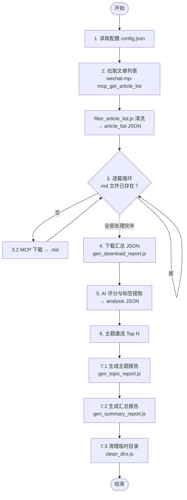
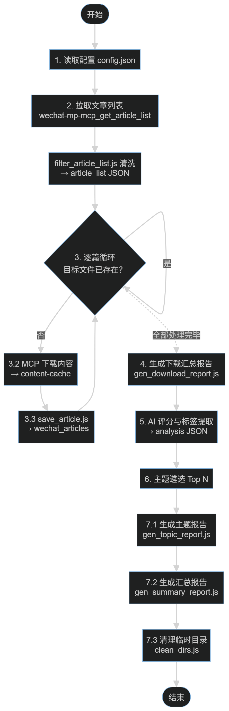

# 微信公众号文章抓取与报告生成技能

本技能用于从配置的微信公众号抓取文章，按时间筛选后下载为 Markdown 文件，并整理生成结构化报告和主题分析文件。

## 核心概念澄清

本技能涉及三个容易混淆的概念，定义如下：

| 概念 | 英文 | 来源 | 说明 |
|------|------|------|------|
| **分类** | Category | 公众号配置 | 每个公众号在 `config.json` 中手工指定一个分类（如 "AI行业媒体"、"科技投资"）。**仅用于公众号的组织管理**，与最终生成的主题无关 |
| **标签** | Tag | AI 自动提取 | 步骤 5 中，AI 模型按文章内容逐篇提取 2-5 个关键词作为标签（如 `大模型`、`Agent`、`融资`）。标签是文章维度、内容维度的描述 |
| **主题** | Topic | 标签聚合生成 | 步骤 6 中，按标签出现频率排序，选取频次最高的 N 个标签。每个标签自动成为一个主题，主题名 = 标签名。一篇文章可同时归属多个主题（因其携带多个标签） |

> 简言之：分类 × 主题（分类只对公众号做组织管理，不影响主题命名）；标签 → 主题（主题由高频标签直接派生，主题名 = 标签名）。

> ⚠️ **执行原则：脚本化**
> 本工作流由 Node.js 脚本处理重复性数据操作（字段清洗、报告生成）。脚本存放在 `.opencode/skills/wechat-mp-articles/scripts/` 目录下，使用前需在该目录下执行 `npm install` 安装依赖（mustache）。
> 
> 主题报告（步骤 7.1）和汇总报告（步骤 7.2）使用 Mustache 编译模板 + JSON 数据直接渲染。下载汇总报告（步骤 4）已改为原生 JSON 输出，不再使用 Mustache 模板。

## 前置依赖

本技能依赖 `wechat-mp-mcp` 工具，需要该 MCP 服务已正确配置。使用以下工具：
- `wechat-mp-mcp_search_account` — 按名称搜索公众号，获取 fake_id
- `wechat-mp-mcp_get_article_list` — 根据 fake_ids 数组批量获取文章列表，支持服务端过滤（`days_to_filter`、`filter_deleted`）
- `wechat-mp-mcp_get_article_content` — 根据文章 URL 获取 Markdown 内容

## 配置说明

配置文件默认路径：`{skill}/config.json`，也可通过命令行参数指定外部配置文件，如 `xxx-config.json`。指定时优先使用外部文件，未指定则回退到默认路径。

```json
{
  "accounts": [
    {
      "name": "公众号名称",
      "fake_id": "公众号fake_id（必填）",
      "category": "分类标签（可选）",
      "enabled": true
    }
  ],
  "settings": {
    "name": "mp-articles",
    "days_to_filter": 3,
    "max_articles_per_account": 10,
    "top_n_articles": 5,
    "topic_count": 3,
    "similarity_threshold": 0.8,
    "language": "zh-CN"
  }
}
```

### 目录变量定义

| 变量 | 说明 | 默认值 |
|------|------|--------|
| `{cwd}` | 项目当前运行目录（项目根目录），由执行上下文自动确定 | 当前工作目录 |
| `{skill}` | 技能目录所在目录，即 `{cwd}/.opencode/skills/{skill_name}` | .opencode/skills/{skill_name} |
| `{config}` | 配置文件路径。可指定外部文件覆盖默认配置 | `{skill}/config.json` |
| `{name}` | `settings.name` 的别名，即 `${name}` | 空 |
| `{temp}` | 临时文件根目录（隐藏目录），即 `{cwd}/.temp/{name}` | `{cwd}/.temp/` |
| `{temp-scripts}` | 步骤 2-6 产生的脚本存放的目录，即 `{temp}/~scripts` | `{temp}/~scripts` |
| `{temp-data}` | 步骤 2-6 产生的所有 JSON 文件存放的目录，即 `{temp}/~data` | `{temp}/~data` |
| `{download-articles}` | 步骤 2-6 产生的所有中间数据和下载内容的存放目录，即 `{temp}/wechat_articles` | `{temp}/wechat_articles` |
| `{output}` | 报告输出根目录，即 `{cwd}/output` | `{cwd}/output` |


### 临时文件约定

> **`{temp-scripts}` 和 `{temp-data}`  目录均为临时产物**，可在步骤 7 完成后安全删除。调用 `clean_dirs.js` 清理：
> 
> ```
> node {skill}/scripts/clean_dirs.js "{temp-scripts}" "{temp-data}"
> ```
> 
> 最终报告输出到 `{output}/${name}/${yyyyMMdd}/`（`${name}` 为空时不嵌套），不受清理影响。

### 参数说明

| 参数 | 别名 | 说明 | 默认值 |
|------|------|------|--------|
| `accounts[].name` | `${account_name}` | 公众号显示名称 | 必填 |
| `accounts[].fake_id` | `${fake_id}` | 公众号的唯一标识，从微信公众平台获取 | 必填 |
| `accounts[].category` | `${account_category}` | 分类标签，用于报告分组 | 无 |
| `accounts[].enabled` | `${enabled}` | 是否启用该公众号。设为 `false` 则抓取时跳过 | `true` |
| `settings.name` | `${name}` | 报告输出目录名称前缀，影响 `output/${name}/${yyyyMMdd}/` | 空（无前缀） |
| `settings.days_to_filter` | `${days_to_filter}` | 筛选最近几天的文章 | 3 |
| `settings.max_articles_per_account` | `${max_articles_per_account}` | 每个公众号最多拉取文章数 | 10 |
| `settings.top_n_articles` | `${top_n_articles}` | 热门文章榜数量 | 5 |
| `settings.topic_count` | `${topic_count}` | 聚类主题数量 | 3 |
| `settings.similarity_threshold` | `${similarity_threshold}` | 文章去重相似度阈值（0-1） | 0.8 |
| `settings.language` | `${language}` | 输出语言 | zh-CN |

### 获取 fake_id 的方法

调用 MCP 工具 `wechat-mp-mcp_search_account` 按公众号名称搜索，返回结果中包含 `fake_id`：

```
wechat-mp-mcp_search_account(keyword="公众号名称")
```

返回的 `fake_id` 填入 `config.json` 对应公众号的 `fake_id` 字段。

## 工作流





### 步骤 1：读取配置

读取 `{config}` 路径下的配置文件（默认 `{skill}/config.json`，支持通过命令行参数指定外部路径），解析公众号列表和全局设置。仅处理 `enabled: true` 的公众号，`enabled: false` 的公众号直接跳过。

所有后续脚本统一使用 `{config}` 变量确定配置来源：若用户提供了外部配置路径，则该路径传递给各脚本；否则各脚本自动回退到 `{skill}/config.json`。

### 步骤 2：拉取文章列表

调用 `wechat-mp-mcp_get_article_list`，传入配置中所有已启用公众号的 `fake_id` 数组，工具自动完成拉取、过滤（`is_deleted`、`update_time`）和合并，且将输出JSON反序列化后**直接写入** `{temp-data}/article_list_{yyyyMMdd}_{NN}_original.json` 文件：

```
wechat-mp-mcp_get_article_list(
  fake_ids=["fid1","fid2",...],
  size=settings.max_articles_per_account,
  days_to_filter=settings.days_to_filter,
  filter_deleted=true
)
```

返回的 `articles` 数组已剔除已删除和超时的文章，每篇携带 `fake_id`。使用 `filter_article_list.js` 脚本同时完成优化（通过 `fake_id` 在 config 中查找对应 `name`/`category` 补齐 `account_name`/`account_category`）和字段精简（仅保留 `aid`, `title`, `cover`, `link`, `digest`, `update_time`, `appmsgid`, `itemidx`, `create_time`, `fake_id`, `account_name`, `account_category`）：

```
node {skill}/scripts/filter_article_list.js \
  {temp-data}/article_list_{yyyyMMdd}_{NN}_original.json \
  {config} \
  {temp-data}/article_list_{yyyyMMdd}_{NN}.json
```

`NN` 为当日序号（01 起），以 `article_list_{yyyyMMdd}_*.json` 最大序号 +1 确定。输出格式：

```json
{
  "aid_12345_1": {
    "aid": "12345_1",
    "title": "...",
    "digest": "...",
    "link": "...",
    "create_time": 1780899900,
    "update_time": 1780899900,
    "appmsgid": 12345,
    "itemidx": 1,
    "cover": "...",
    "fake_id": "...",
    "account_name": "公众号名称",
    "account_category": "分类标签"
  },
  ...
}
```

### 步骤 3：逐篇下载文章

对每篇符合条件的文章（来自步骤 2 清洁后的 `article_list_{yyyyMMdd}_{NN}.json`），逐篇执行以下流程：

#### 3.1 文件存在性检查（前置过滤）

目标文件路径为 `{download-articles}/{aid}_{yyyyMMdd}_{account_name}_{title}.md`（`{yyyyMMdd}` 由 `update_time` 转换，`{title}` 做 sanitize：将 `\ / : * ? " < > |` 替换为 `_`）。

对该篇文章先构造文件名，若 `{download-articles}/` 下**已存在**该文件，**跳过此篇的全部后续流程**（不调用 MCP），直接进入下一篇文章。

仅当文件不存在时，才进入 3.2 的下载与保存流程。

#### 3.2 下载并保存

调用 `wechat-mp-mcp_get_article_content` 获取 Markdown 纯文本，直接写入 `{download-articles}/`：

```
content=$(wechat-mp-mcp_get_article_content(url={link}, format="markdown"))
```

**该 MCP 工具直接返回 Markdown 文本（纯字符串，非 JSON）**，且已自动移除 `![cover_image]` 之前的前缀内容。

按以下规则构造文件名并保存（不需要额外脚本）：

1. `{yyyyMMdd}` = 从 `update_time` 时间戳转换（`new Date(update_time * 1000).toISOString().slice(0,10).replace(/-/g,"")`）
2. 对 `account_name` 和 `title` 做 sanitize：将 `\ / : * ? " < > |` 替换为 `_`，截断前 80 字符
3. 写入 `{download-articles}/{aid}_{yyyyMMdd}_{account_name}_{title}.md`

> 元数据（标题、公众号、链接、摘要、时间等）存储在步骤 2 的 `article_list_{yyyyMMdd}_{NN}.json` 中，脚本 `gen_topic_report.js` 和 `gen_summary_report.js` 从该 JSON 文件直接读取，不再依赖 `.md` 文件头。

#### 3.3 重试机制

下载或脚本执行失败时自动重试最多 2 次，间隔 2 秒。仍失败则在步骤 4 的 `download_report_{yyyyMMdd}.json` 中标记 `"download_status": "失败"`，但保留标题和链接。

### 步骤 4：生成下载汇总报告

运行 `gen_download_report.js` 脚本，扫描实际下载情况，输出 JSON 格式的下载汇总报告：

```
node {skill}/scripts/gen_download_report.js \
  {temp-data}/article_list_{yyyyMMdd}_{NN}.json \
  {download-articles}/download_report_{yyyyMMdd}.json \
  {download-articles}   # 可选，指定文章存放目录，默认取输出路径所在目录
```

下载报告为中间产物，固定输出到 `{download-articles}/`，不受 `${name}` 影响。

脚本读取文章列表 JSON 中的元数据，比对 `{download-articles}/` 下实际存在的 `.md` 文件，生成 JSON 报告。输出结构参考 `{skill}/templates/template_download_report.json`。

输出 JSON 结构：

```json
{
  "timestamp": "2026-06-10 10:39",
  "summary": {
    "accounts": 5,
    "qualifying_articles": 3,
    "success_count": 3,
    "fail_count": 0
  },
  "account_details": [
    {
      "name": "壹沓科技",
      "category": "供应链科技",
      "qualifying_count": 1,
      "success_count": 1,
      "fail_count": 0,
      "status": "正常"
    }
  ],
  "articles": [
    {
      "index": 1,
      "aid": "2247502767_1",
      "title": "小沓AI数字员工亮相第十二届上交会",
      "account_name": "壹沓科技",
      "account_category": "供应链科技",
      "file_path": "2247502767_1_20260608_壹沓科技_小沓AI数字员工亮相第十二届上交会.md",
      "url": "https://mp.weixin.qq.com/s/...",
      "digest": "...",
      "update_time": 1780916109,
      "download_status": "成功"
    }
  ]
}
```

失败记录仅在有下载失败的场景下出现（`"failed"` 字段）。

### 步骤 5：内容评分与标签提取（AI 驱动）

读取每篇文章的内容，由 AI 逐篇进行质量评分（1-5 分）和标签提取（2-5 个关键词/标签）。

#### 5.1 质量评分维度

| 维度 | 评分依据 |
|------|---------|
| **时效性** | 发布时间越接近当前，分数越高 |
| **原创性** | 原创标识、独家内容加分 |
| **信息密度** | 有效信息占比高、有数据/案例支撑加分 |
| **影响力** | 阅读量、互动量（如可用） |
| **相关性** | 与配置的分类标签匹配度 |

#### 5.2 标签提取

从每篇文章中提取 2-5 个有意义的主题标签（如 `大模型`、`Agent`、`融资`、`芯片`、`开源`），避免无意义的二元组碎片。

#### 5.3 产出格式

AI 处理完成后，将结果写入 `{temp-data}/analysis_report_{yyyyMMdd}.json`，结构如下：

```json
{
  "timestamp": "2026-06-09 15:10",
  "articles": [
    {
      "link": "https://mp.weixin.qq.com/s/xxx",
      "score": 4,
      "tags": ["大模型", "开源", "MoE"]
    }
  ]
}
```

该文件供步骤 6-7（`gen_topic_report.js`）读取，由脚本完成去重、评分回写和主题报告生成。

### 步骤 6：主题遴选

使用配置中 `${topic_count}` 的值从全量标签中遴选出文章数最多的 N 个标签作为主题，仅对选中的主题生成独立报告：

1. **加载标签数据**：优先读取 `analysis_report_{yyyyMMdd}.json`（步骤 5 产出），按 `link`（原文链接）匹配每篇文章的标签；若无标签数据，从标题+摘要提取高频二字词作为备选
2. **标签排名**：对每个标签计算综合得分 `文章数×1 + 覆盖公众号数×2 + 平均质量评分×1`，公众号多样性权重最高
3. **遴选 Top N**：按得分降序取前 `${topic_count}` 个标签作为最终主题。主题名直接使用标签名（标签由 AI 从内容提取，已是对主题的精准概括）
4. **文章归属**：每篇文章根据其携带的标签自然归属到主题中。一篇文章可出现在多个主题下。未携带任何 Top 标签的文章不出现在主题报告中（仍完整保留在汇总报告中）

### 步骤 7：生成报告

#### 7.1 生成主题报告

根据步骤 6 选定的 Top N 主题，为每个主题生成独立分析报告。同时完成去重（标题编辑距离）和质量评分关联：

```
node {skill}/scripts/gen_topic_report.js \
  {download-articles} \
  {output}/{yyyyMMdd} \
  {temp-data}/analysis_report_{yyyyMMdd}.json \
  {config}   # 可选，传入后脚本内部将 outDir 从 {output}/{yyyyMMdd} 调整为 {output}/{name}/{yyyyMMdd}
  {temp-data}/article_list_{yyyyMMdd}_{NN}.json   # 可选，文章元数据，不传入则退化到解析 .md 头信息
```

> 命令行中的 `{output}/{yyyyMMdd}` 为内部基准路径，最终输出到 `{output}/${name}/${yyyyMMdd}/`，与 `gen_summary_report.js` 行为一致。

脚本逻辑：
1. **去重**：标题清洗后计算编辑距离相似度 > 0.8 则归为重复组，仅保留最早发布的一篇
2. **评分关联**：从 `analysis_report_{yyyyMMdd}.json` 读取 AI 评定的分数，关联到文章数据中（评分已不再回写 `.md` 文件头，而是记录在增强后的 analysis JSON 内）
3. **主题选取**：读取 `analysis_report_{yyyyMMdd}.json` 中每篇文章的标签，按综合得分遴选 Top N 标签作为主题。主题名直接使用标签名（不由分类决定）
4. **生成主题报告**：每个主题收集携带该标签的所有文章，填充模板 `templates/template_topic.md` 后输出到 `topic_{标签名}.md`。若文件名冲突，自动追加 `_2`、`_3` 等后缀
5. **回写增强 analysis**：将去重信息合并回 `analysis_report_{yyyyMMdd}.json`

| 模板变量 | 说明 |
|---------|------|
| `{{topic_title}}` | 主题名称 |
| `{{heat}}` | 热度标签（高/中/低） |
| `{{article_count}}` / `{{account_count}}` | 文章数 / 公众号数 |
| `{{topic_overview}}` | 主题概述段落 |
| `{{#articles}}...{{/articles}}` | 文章列表，含 `{{publish_date}}`, `{{account_name}}`, `{{category}}`, `{{title}}`, `{{url}}`, `{{key_point}}`, `{{relevance_score}}` |
| `{{#related_topics}}...{{/related_topics}}` | 关联主题索引 |
| `{{#insights}}...{{/insights}}` / `{{^insights}}...{{/insights}}` | 核心洞察（待步骤 5-6 完成后填充） |

#### 7.2 生成汇总报告

运行 `gen_summary_report.js` 脚本，从 `article_list` JSON 读取文章元数据，结合 `{output}/{name}/{yyyyMMdd}/` 下的主题文件，生成汇总报告：

```
node {skill}/scripts/gen_summary_report.js \
  {download-articles} \
  {output}/{yyyyMMdd} \
  {temp-data}/analysis_report_{yyyyMMdd}.json \
  {config}   # 可选，传入后脚本内部将 outDir 从 {output}/{yyyyMMdd} 调整为 {output}/{name}/{yyyyMMdd}
  {yyyyMMdd} # 可选，日期后缀，默认当天
  {temp-data}/article_list_{yyyyMMdd}_{NN}.json   # 可选，文章元数据
```

> 命令行中的 `{output}/{yyyyMMdd}` 为内部基准路径，若 `${name}` 有值，脚本自动将输出目录调整为 `{output}/${name}/${yyyyMMdd}`，与 `gen_topic_report.js` 行为一致。
>
> 汇总报告文件名固定为 `summary_report_{dateSuffix}.md`，`dateSuffix` 默认取当天日期（yyyyMMdd），也可通过第 5 个参数手动指定。

模板 `templates/template_summary.md` 包含以下区块：

| 模板变量 | 说明 |
|---------|------|
| `{{timestamp}}` | 生成时间 |
| `{{article_count}}` | 文章总数 |
| `{{account_count}}` | 公众号数 |
| `{{category_count}}` | 主题分类数 |
| `{{earliest_date}}` / `{{latest_date}}` | 最早/最晚文章日期 |
| `{{#topics}}...{{/topics}}` / `{{^topics}}...{{/topics}}` | 今日遴选主题列表（引用 7.1 输出，含 `{{title}}`, `{{article_count}}`, `{{account_count}}`, `{{file}}`） |
| `{{#account_summary}}...{{/account_summary}}` | 公众号汇总表（含 `{{name}}`, `{{category}}`, `{{article_count}}`, `{{best_score}}`） |
| `{{#article_list}}...{{/article_list}}` | 全量文章一览表（含 `{{index}}`, `{{date}}`, `{{account}}`, `{{category}}`, `{{title}}`, `{{url}}`, `{{digest}}`, `{{score}}`） |
| `{{#highlights}}...{{/highlights}}` / `{{^highlights}}...{{/highlights}}` | 重点文章推荐（评分 >= 4） |

> 当前版本以 category 为分组依据，待步骤 5-6（标签提取与主题聚类）完成后，可升级为基于内容相似度的聚类主题。

#### 7.3 清理临时目录

报告生成完毕后，调用清理脚本删除 `{scripts}` 和 `{temp-data}` 目录下的所有内容：

``` bash
node {skill}/scripts/clean_dirs.js "{scripts}" "{temp-data}"
```

该脚本逐一清空指定目录下的所有文件和子目录，目录本身保留。

## 错误处理

- **文章拉取失败**：如果某个公众号拉取失败，跳过该公众号，在报告中标注"抓取失败"
- **内容下载失败**：自动重试最多 2 次。仍失败则在报告中保留标题和链接，标注"内容获取失败"
- **完整性校验失败**：步骤 3.4 发现缺失文件时，自动补下缺失文章。补下仍失败则记入下载结果数据，由步骤 4 输出到 `download_report_{yyyyMMdd}.json`
- **配置缺失**：如果 `fake_id` 为空或配置无效，报错提示用户检查配置

## 输出目录结构

```
{output}/
└── {name}/
    └── {yyyyMMdd}/
        ├── summary_report_{yyyyMMdd}.md  # 汇总报告（步骤 7.2，含遴选主题、公众号汇总、文章总览、重点推荐）
        ├── topic_{标签名1}.md             # 遴选主题报告（步骤 7.1，主题名 = 标签名）
        ├── topic_{标签名2}.md             # 遴选主题报告（步骤 7.1）
        └── topic_{标签名3}.md             # 遴选主题报告（步骤 7.1，数量由 `${topic_count}` 控制）

{download-articles}/
├── {aid}_{yyyyMMdd}_{公众号名称}_{title}.md  # 已下载的文章内容（无头信息，步骤 3 生成）
├── download_report_{yyyyMMdd}.json         # 下载汇总报告（JSON 格式，步骤 4 生成）
└── ...

{scripts}/   ← 临时脚本输出
{temp-data}/ ← 临时 JSON 数据

> `{scripts}` 和 `{temp-data}` 为临时目录，步骤 7.3 的清理脚本会清空其下所有内容。文章下载目录 `{download-articles}` 中的 `.md` 文件为输出产物（不含头部元数据，元数据存储在 `article_list` JSON 中），不受清理影响。最终报告输出到 `{output}/${name}/${yyyyMMdd}/`（`${name}` 为空时不嵌套），也不受清理影响。
```