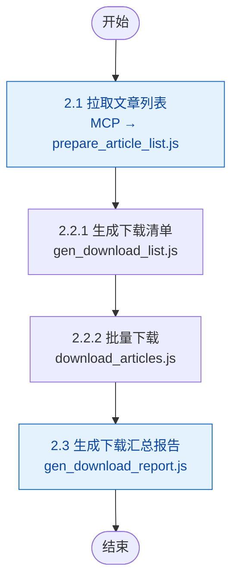

# 步骤 2：文章下载

> 本文档为 [SKILL.md](../SKILL.md) 的步骤详情子文档。变量定义见 [SKILL.md#变量定义](../SKILL.md#变量定义)。

合并完成拉取文章列表、逐篇下载文章、生成下载汇总报告三个子任务。

> ⚠️ **拉取列表仍使用 MCP 工具 `wechat-mp-mcp_get_article_list`**；下载内容改为脚本直接通过 HTTP API 获取，不再走 MCP 通道，以节省 token 并提升性能。

### 步骤整体输入/输出

| 方向 | 文件路径 | 说明 | 下游消费 |
|------|---------|------|---------|
| 输入 | `{config-runtime}` | 公众号配置与全局设置（来自步骤 1） | 2.1 |
| 输出 | `{download-articles}/*.md` | 文章 Markdown 原文（每篇一篇） | 步骤 3.1、步骤 4.1/4.2 |
| 输出 | `{download-articles}/download_report_{yyyyMMdd}.json` | 下载结果汇总 JSON（含文章元数据） | 步骤 3.1（merge_analysis_meta） |

### 子流程



## 2.1 拉取文章列表

### 输入/输出

| 步骤 | 方向 | 文件路径 | 说明 | 上游来源 | 下游消费 |
|------|------|---------|------|---------|---------|
| 2.1.1 MCP 拉取 | 输出 | `{temp-data}/article_list_{yyyyMMdd}_original.json` | MCP 返回的原始文章数据 | — | 2.1.2 |
| 2.1.2 prepare_article_list.js | 输入 | `{temp-data}/article_list_{yyyyMMdd}_original.json` | 原始文章数据 | 2.1.1 | — |
| 2.1.2 prepare_article_list.js | 输入 | `{config-runtime}` | 用于补齐 account_name/category | 步骤 1 | — |
| 2.1.2 prepare_article_list.js | 输出 | `{temp-data}/article_list_{yyyyMMdd}.json` | 清洗后的文章元数据（keyed by aid） | — | 步骤 2.2、步骤 2.3 |

调用 `wechat-mp-mcp_get_article_list`，传入配置中所有已启用公众号的 `fake_id` 数组，工具自动完成拉取、过滤（`is_deleted`、`update_time`）和合并，且将输出JSON反序列化后**直接写入** `{temp-data}/article_list_{yyyyMMdd}_original.json` 文件：

```
wechat-mp-mcp_get_article_list(
  fake_ids=["fid1","fid2",...],
  size=settings.max_articles_per_account,
  days_to_filter=settings.days_to_filter,
  filter_deleted=true
)
```

返回的 `articles` 数组已剔除已删除和超时的文章，每篇携带 `fake_id`。使用 `prepare_article_list.js` 脚本同时完成优化（通过 `fake_id` 在 config 中查找对应 `name`/`category` 补齐 `account_name`/`account_category`）和字段精简（仅保留 `aid`, `title`, `cover`, `link`, `digest`, `update_time`, `appmsgid`, `itemidx`, `create_time`, `fake_id`, `account_name`, `account_category`）：

```
node {skill}/scripts/prepare_article_list.js \
  {temp-data}/article_list_{yyyyMMdd}_original.json \
  {config-runtime} \
  {temp-data}/article_list_{yyyyMMdd}.json
```
输出格式：

```json
{
  "aid_12345_1": {
    "aid": "12345_1",
    "title": "...",
    "digest": "...",
    "link": "...",
    "create_time": 1780899900,
    "update_time": 1780899900,
    "appmsgid": 12345,
    "itemidx": 1,
    "cover": "...",
    "fake_id": "...",
    "account_name": "公众号名称",
    "account_category": "分类标签",
    "file_name": "aid_12345_1_20260611_公众号名称_文章标题.md"
  },
  ...
}
```

## 2.2 逐篇下载文章

### 输入/输出

| 方向 | 文件路径 | 说明 | 上游来源 | 下游消费 |
|------|---------|------|---------|---------|
| 输入 | `{temp-data}/article_list_{yyyyMMdd}.json` | 待下载文章元数据（含预生成 `file_name`） | 2.1 | — |
| 输出 | `{temp-data}/list_pending.txt` | 初始包含全部待下载 aid，逐篇移除已处理项 | 2.2.1 | 2.2.2 |
| 输出 | `{temp-data}/list_failed.txt` | 下载失败文章（每行 `aid\|原因`），初始为空 | 2.2.1 | 步骤 2.2.2 / 2.3 |
| 输出（每篇） | `{download-articles}/{file_name}` | 下载的 Markdown 原文 | — | 步骤 3.1、步骤 4.1/4.2 |

流程分三阶段：

### 2.2.1 生成下载清单

运行 `gen_download_list.js`，读取 `article_list_{yyyyMMdd}.json`，生成待下载清单（所有 aid 全部写入，已存在文件的跳过由 2.2.2 的 `download_articles.js` 自行处理）：

```
node {skill}/scripts/gen_download_list.js \
  {temp-data}/article_list_{yyyyMMdd}.json \
  {download-articles} \
  {temp-data}
```

生成两个文件：
- `{temp-data}/list_pending.txt`：全部待下载 aid 列表，每行一个
- `{temp-data}/list_failed.txt`：初始为空，后续记录失败项

### 2.2.2 批量下载 + 校验

运行 `download_articles.js` 脚本，自动从 `list_pending.txt` 读取待下载列表，通过 HTTP API 批量下载，完成后更新 `list_pending.txt` 和 `list_failed.txt`：

```
node {skill}/scripts/download_articles.js \
  {temp-data}/article_list_{yyyyMMdd}.json \
  {download-articles} \
  {temp-data}
```

**脚本逻辑**：

1. 读取 `list_pending.txt` 中所有 aid
2. 从 `article_list_{yyyyMMdd}.json` 获取各 aid 对应的 `link` 和 `file_name`
3. 对每篇 aid，先检查 `{download-articles}/{file_name}` **是否已存在且内容有效**（含 `![cover_image]`），若有效则跳过（标记成功，不下载）
4. 若文件不存在或无效，通过 **axios** 向 `{PB_WECHAT_MP_API_BASE}/download?url={link}&format=markdown` 发送 GET 请求获取 Markdown 纯文本
5. 将内容直接写入 `{download-articles}/{file_name}`
6. 内联校验，根据校验结果执行重试：

| 退出码 | 含义 | 处理方式 |
|--------|------|---------|
| 0 | 有效（含 `![cover_image]`） | 从 `list_pending.txt` 移除，继续下一篇 |
| 1 | 文件缺失 / 未知 aid | 网络/IO 错误，等待 10 秒后重试，最多 3 次 |
| 2 | 文件存在但内容无效（无 `![cover_image]`） | 删除文件、重新下载并校验，最多 2 次 |

**重试策略**（由 `download_articles.js` 自动处理）：

- **文件已存在且有效**：跳过下载，直接标记为成功，从 `list_pending.txt` 移除
- **HTTP/网络错误**：打印错误信息，等待 10 秒后重试下载，最多 3 次。仍失败则记入 `list_failed.txt`（格式：`{aid}|网络/IO错误`）并从 `list_pending.txt` 移除
- **内容无效（退出码 2）**：删除无效文件，重新下载并校验，最多 2 次。仍失败则记入 `list_failed.txt`（格式：`{aid}|内容校验失败`）并从 `list_pending.txt` 移除
- **成功（退出码 0）**：从 `list_pending.txt` 移除该 aid

> 文件名已在 2.1 步骤由 `prepare_article_list.js` 预生成写入 `article_list_{yyyyMMdd}.json` 的 `file_name` 字段。规则：`{aid}_{yyyyMMdd}_{account_name}_{title}.md`，其中 `account_name` 和 `title` 做 sanitize（`\ / : * ? " < > |` 替换为 `_`，截断前 80 字符）。

## 2.3 生成下载汇总报告

### 输入/输出

| 方向 | 文件路径 | 说明 | 上游来源 | 下游消费 |
|------|---------|------|---------|---------|
| 输入 | `{temp-data}/article_list_{yyyyMMdd}.json` | 文章元数据 | 2.1 | — |
| 输入 | `{download-articles}/` | 扫描该目录下实际存在的 `.md` 文件 | 2.2 | — |
| 输入 | `{temp-data}/list_failed.txt` | 下载失败记录 | 2.2.2 | — |
| 输出 | `{download-articles}/download_report_{yyyyMMdd}.json` | 下载结果汇总 JSON | — | 人工查阅（非后续步骤输入） |

所有文章处理完毕后，运行 `gen_download_report.js` 脚本，扫描实际下载情况，输出 JSON 格式的下载汇总报告：

```
node {skill}/scripts/gen_download_report.js \
  {temp-data}/article_list_{yyyyMMdd}.json \
  {download-articles} \
  {temp-data}/list_failed.txt \
  {download-articles}/download_report_{yyyyMMdd}.json
```

输出 JSON 结构：

```json
{
  "timestamp": "2026-06-10 10:39",
  "summary": {
    "accounts": 5,
    "qualifying_articles": 3,
    "success_count": 3,
    "fail_count": 0
  },
  "account_details": [
    {
      "name": "壹沓科技",
      "category": "供应链科技",
      "qualifying_count": 1,
      "success_count": 1,
      "fail_count": 0,
      "status": "正常"
    }
  ],
  "articles": [
    {
      "index": 1,
      "aid": "2247502767_1",
      "title": "小沓AI数字员工亮相第十二届上交会",
      "account_name": "壹沓科技",
      "account_category": "供应链科技",
      "file_path": "2247502767_1_20260608_壹沓科技_小沓AI数字员工亮相第十二届上交会.md",
      "url": "https://mp.weixin.qq.com/s/...",
      "digest": "...",
      "update_time": 1780916109,
      "download_status": "成功"
    }
  ]
}
```

`gen_download_report.js` 从 `list_failed.txt` 读取失败原因合并到报告，同时扫描 `{download-articles}/` 目录下的 `.md` 文件进行双重校验。

## 错误处理

- **文章拉取失败**：如果某个公众号拉取失败，跳过该公众号，在下载报告中标注"抓取失败"
- **内容下载失败**：按 2.2.2 重试策略处理，超过最大重试次数后记入 `list_failed.txt`，在下载报告中标注失败原因
- **完整性校验失败**：`gen_download_report.js` 生成报告时若发现文章元数据中存在文章没有对应文件，将其统计为失败
