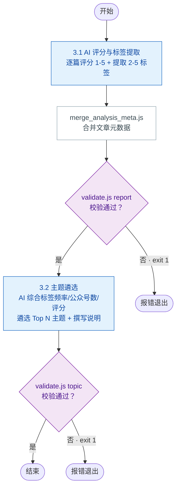

# 步骤 3：文章分析

> 本文档为 [SKILL.md](../SKILL.md) 的步骤详情子文档。目录变量见 [SKILL.md#目录变量定义](../SKILL.md#目录变量定义)。

合并完成 AI 评分与标签提取、主题遴选两个子任务。

### 步骤整体输入/输出

| 方向 | 文件路径 | 说明 | 下游消费 |
|------|---------|------|---------|
| 输入 | `{download-articles}/*.md` | 文章 Markdown 原文（每篇一篇） | 3.1 |
| 输入 | `{download-articles}/download_report_{yyyyMMdd}.json` | 下载结果汇总 JSON（含文章元数据） | 3.1（merge_analysis_meta） |
| 输出 | `{download-articles}/analysis_report_{yyyyMMdd}.json` | AI 评分与标签 | 步骤 3.2、步骤 4.1/4.2 |
| 输出 | `{download-articles}/analysis_topic_{yyyyMMdd}.json` | AI 遴选的主题及推理性说明 | 步骤 4.1 |

### 子流程



## 3.1 AI 评分与标签提取

### 输入/输出

| 方向 | 文件路径 | 说明 | 上游来源 | 下游消费 |
|------|---------|------|---------|---------|
| 输入 | `{download-articles}/*.md` | 每篇文章的 Markdown 原文（供 AI 阅读） | 步骤 2.2 | — |
| 输入 | `{download-articles}/download_report_{yyyyMMdd}.json` | 文章元数据（aid、标题、时间等） | 步骤 2.3 | — |
| 输出 | `{download-articles}/analysis_report_{yyyyMMdd}.json` | AI 评分与标签结果 | — | 步骤 3.2、步骤 4.1/4.2 |

读取每篇文章的内容，由 AI 逐篇进行质量评分（1-5 分）和标签提取（2-5 个关键词/标签）。

### 质量评分维度

| 维度 | 评分依据 |
|------|---------|
| **时效性** | 发布时间越接近当前，分数越高 |
| **原创性** | 原创标识、独家内容加分 |
| **信息密度** | 有效信息占比高、有数据/案例支撑加分 |
| **影响力** | 阅读量、互动量（如可用） |
| **相关性** | 与配置的分类标签匹配度 |

### 标签提取

从每篇文章中提取 2-5 个有意义的主题标签（如 `大模型`、`Agent`、`融资`、`芯片`、`开源`）。

AI 处理完成后，将结果写入 `{download-articles}/analysis_report_{yyyyMMdd}.json`。

然后运行 `merge_analysis_meta.js`，将 `download_report` 中的文章元数据合并到 `analysis_report`，使其成为自包含的数据源供后续步骤使用：

```
node {skill}/scripts/merge_analysis_meta.js \
  {download-articles}/download_report_{yyyyMMdd}.json \
  {download-articles}/analysis_report_{yyyyMMdd}.json
```

合并后运行 `validate.js` 校验文件名与数据结构：

```
node {skill}/scripts/validate.js report {download-articles}/analysis_report_{yyyyMMdd}.json
```

校验通过输出 `Valid: analysis_report_{yyyyMMdd}.json (N article(s))`，失败 exit 1 并列出具体问题。

最终 `analysis_report` 每篇文章包含字段：`link`、`score`（1-5 或 null）、`tags`，以及合并的元数据 `title`、`account_name`、`account_category`、`digest`、`update_time`、`file_path`、`aid`。示例：

```json
{
  "timestamp": "2026-06-09 15:10",
  "articles": [
    {
      "link": "https://mp.weixin.qq.com/s/xxx",
      "score": 4,
      "tags": ["大模型", "开源", "MoE"]
    }
  ]
}
```

## 3.2 主题遴选

### 输入/输出

| 方向 | 文件路径 | 说明 | 上游来源 | 下游消费 |
|------|---------|------|---------|---------|
| 输入 | `{download-articles}/analysis_report_{yyyyMMdd}.json` | AI 评分与标签数据 | 步骤 3.1 | — |
| 输入 | `{config}` | 配置中的 `${topic_count}` | 步骤 1 | — |
| 输出 | `{download-articles}/analysis_topic_{yyyyMMdd}.json` | AI 遴选的主题及遴选理由 | — | 步骤 4.1 |

AI 读取 `analysis_report_{yyyyMMdd}.json`，按以下算法筛选主题并撰写推理性说明：

1. **标签排名**：对每个标签计算综合得分 `文章数×1 + 覆盖公众号数×2 + 平均质量评分×1`，公众号多样性权重最高
2. **遴选 Top N**：按得分降序取前 `${topic_count}` 个标签作为最终主题。主题名直接使用标签名
3. **撰写遴选理由**：对每个选中的主题，结合文章内容、覆盖面、评分等信息，用一段推理文字说明为何该方向值得作为独立主题

输出格式：

```json
{
  "topics": [
    {
      "name": "大模型",
      "reasoning": "本周3篇文章聚焦大模型开源生态（Claude新版本、Llama 4发布），覆盖2个不同公众号，平均评分4.3，信息密度高且时效性强",
      "topic_overview": "可选，AI 撰写的主题概述段落，比自动生成的更丰富",
      "insights": [
        { "title": "可选，洞察标题", "detail": "可选，洞察详细内容" }
      ]
    }
  ]
}
```

AI 写入后运行 `validate.js` 校验文件名与数据结构：

```
node {skill}/scripts/validate.js topic {download-articles}/analysis_topic_{yyyyMMdd}.json
```

校验通过输出 `Valid: analysis_topic_{yyyyMMdd}.json (N topic(s))`，失败 exit 1 并列出具体问题。

> `topic_overview` 和 `insights` 可选；若未提供，`gen_topic_report.js` 自动生成默认概述，洞察留空。该文件由 AI 写入，步骤 4.1 的 `gen_topic_report.js` 读取（必需）。

## 错误处理

- **AI 评分失败**：单篇文章评分超时或 API 异常时，跳过该篇评分，在 `analysis_report.json` 中标记 `"score": null`
- **标签数量不足**：当有效标签数少于 `${topic_count}` 时，以实际标签数作为主题数，不填充空主题
