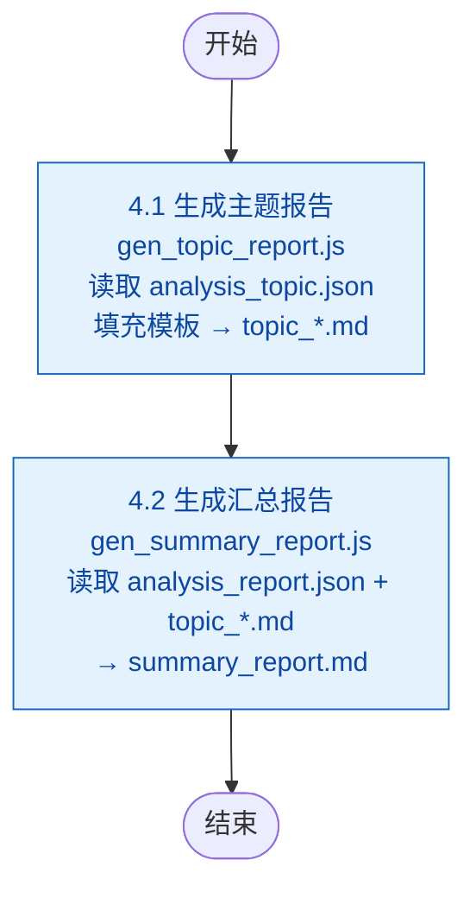

# 步骤 4：生成汇总报告

> 本文档为 [SKILL.md](../SKILL.md) 的步骤详情子文档。变量定义见 [SKILL.md#变量定义](../SKILL.md#变量定义)。

### 整体输入/输出

| 方向 | 文件路径 | 说明 | 上游来源 | 下游消费 |
|------|---------|------|---------|---------|
| 输入 | `{download-articles}/` | 已下载的 `.md` 文件 | 步骤 2.2 | 4.1 扫描文件路径 |
| 输入 | `{download-articles}/analysis_report_{yyyyMMdd}.json` | 文章元数据 + AI 评分/标签/去重信息（含合并的元数据） | 步骤 3.1 | 4.1/4.2 读取文章数据 |
| 输入 | `{download-articles}/analysis_topic_{yyyyMMdd}.json` | AI 遴选的主题、遴选理由、概述与洞察 | 步骤 3.2 | 4.1 驱动主题报告生成 |
| 输入 | `{config-runtime}` | 配置参数（输出目录前缀等） | 步骤 1 | 4.1/4.2 确定输出路径 |
| 输出 | `{output}/{profile}/{yyyyMMdd}/topic_{标签名}.md` | 每主题一份独立分析报告 | 4.1 | 4.2 引用 + 最终产物 |
| 输出 | `{output}/{profile}/{yyyyMMdd}/summary_report_{yyyyMMdd}.md` | 汇总所有主题和文章的最终报告 | 4.2 | 最终产物 |

Step 4 全部由脚本驱动，无 AI 调用。所有 AI 产出的数据（评分、标签、主题、概述、洞察）均在 Step 3 中完成并固化到 JSON 文件。

### 子流程



## 4.1 生成主题报告

### 输入/输出

| 方向 | 文件路径 | 说明 | 上游来源 | 下游消费 |
|------|---------|------|---------|---------|
| 输入 | `{download-articles}/` | 扫描 `.md` 文件列表 | 步骤 2.2 | — |
| 输入 | `{download-articles}/analysis_report_{yyyyMMdd}.json` | AI 评分、标签及去重信息 | 步骤 3.1 | — |
| 输入 | `{download-articles}/analysis_topic_{yyyyMMdd}.json` | AI 遴选的主题、遴选理由、概述与洞察 | 步骤 3.2 | — |
| 输入 | `{config-runtime}` | 配置参数 | 步骤 1 | — |
| 输出（每主题） | `{output}/{profile}/{yyyyMMdd}/topic_{标签名}.md` | 主题报告 | — | 步骤 4.2 |

根据 `analysis_topic_{yyyyMMdd}.json` 定义的主题列表，为每个主题生成独立分析报告。脚本自动完成去重（标题编辑距离）和评分关联：

```
node {skill}/scripts/gen_topic_report.js \
  {download-articles} \
  {output}/{profile}/{yyyyMMdd} \
  {download-articles}/analysis_report_{yyyyMMdd}.json \
  {config-runtime} \
  {download-articles}/analysis_topic_{yyyyMMdd}.json    # 必需，AI 预选主题
```

### 脚本逻辑

1. **去重**：标题清洗后计算编辑距离相似度 > 0.8 则归为重复组，仅保留最早发布的一篇
2. **评分关联**：从 `analysis_report_{yyyyMMdd}.json` 读取 AI 评定的分数，关联到文章数据中
3. **按主题匹配文章**：遍历 `analysis_topic_{yyyyMMdd}.json` 中的主题，以其 `name` 匹配文章标签，收集带有该标签的所有文章
4. **生成主题报告**：每个主题填充模板 `templates/template_topic.md`（优先使用 AI 撰写的 `topic_overview` 和 `insights`），输出到 `topic_{标签名}.md`
5. **回写增强 analysis**：将去重信息合并回 `analysis_report_{yyyyMMdd}.json`

### 主题报告模板变量

| 模板变量 | 说明 |
|---------|------|
| `{{topic_title}}` | 主题名称 |
| `{{topic_reasoning}}` | 遴选理由（来自 `analysis_topic.json`） |
| `{{heat}}` | 热度标签（高/中/低） |
| `{{article_count}}` / `{{account_count}}` | 文章数 / 公众号数 |
| `{{topic_overview}}` | 主题概述段落 |
| `{{#articles}}...{{/articles}}` | 文章列表，含 `{{index}}`, `{{date}}`, `{{account}}`, `{{tag}}`, `{{title}}`, `{{url}}`, `{{digest}}`, `{{relevance}}` |
| `{{#related_topics}}...{{/related_topics}}` | 关联主题索引，含 `{{name}}`, `{{relation}}` |
| `{{#insights}}...{{/insights}}` / `{{^insights}}...{{/insights}}` | 核心洞察（来自 `analysis_topic.json`），含 `{{title}}`, `{{detail}}` |

## 4.2 生成汇总报告

### 输入/输出

| 方向 | 文件路径 | 说明 | 上游来源 |
|------|---------|------|---------|
| 输入 | `{download-articles}/` | 扫描 `.md` 文件列表 | 步骤 2.2 |
| 输入 | `{download-articles}/analysis_report_{yyyyMMdd}.json` | 文章元数据 + AI 评分数据 | 步骤 3.1 |
| 输入 | `{config-runtime}` | 报告输出目录配置 | 步骤 1 |
| 输入 | `{output}/{profile}/{yyyyMMdd}/topic_*.md` | 4.1 生成的主题报告（用于关联） | 步骤 4.1 |
| 输出 | `{output}/{profile}/{yyyyMMdd}/summary_report_{yyyyMMdd}.md` | 最终汇总报告 | 最终产物 |

运行 `gen_summary_report.js` 脚本，从 `analysis_report` JSON 读取文章元数据和 AI 评分，结合主题文件，生成汇总报告：

```
node {skill}/scripts/gen_summary_report.js \
  {download-articles} \
  {output}/{profile}/{yyyyMMdd} \
  {download-articles}/analysis_report_{yyyyMMdd}.json \
  {config-runtime} \
  {yyyyMMdd} # 可选，日期后缀，默认当天
```

> 汇总报告文件名固定为 `summary_report_{dateSuffix}.md`。

## 错误处理

- **模板渲染失败**：Mustache 模板语法错误或变量缺失时，脚本报错并跳过该模板，不影响其他报告生成
- **主题报告为空**：某主题下无可选文章时（全部被去重），跳过该主题报告，不在汇总报告中引用

### 汇总报告模板变量

| 模板变量 | 说明 |
|---------|------|
| `{{timestamp}}` | 生成时间 |
| `{{article_count}}` | 文章总数 |
| `{{account_count}}` | 公众号数 |
| `{{category_count}}` | 主题分类数 |
| `{{earliest_date}}` / `{{latest_date}}` | 最早/最晚文章日期 |
| `{{#topics}}...{{/topics}}` / `{{^topics}}...{{/topics}}` | 今日遴选主题列表（引用 4.1 输出，含 `{{title}}`, `{{overview}}`, `{{article_count}}`, `{{account_count}}`, `{{heat}}`, `{{file}}`） |
| `{{#account_summary}}...{{/account_summary}}` | 公众号汇总表（含 `{{name}}`, `{{category}}`, `{{article_count}}`, `{{best_score}}`） |
| `{{#article_list}}...{{/article_list}}` | 全量文章一览表（含 `{{index}}`, `{{date}}`, `{{account}}`, `{{category}}`, `{{title}}`, `{{url}}`, `{{score}}`, `{{tags}}`） |
| `{{#highlights}}...{{/highlights}}` / `{{^highlights}}...{{/highlights}}` | 重点文章推荐（评分 >= 4），含 `{{source}}`, `{{title}}`, `{{url}}`, `{{reason}}`, `{{tags}}` |
| `{{#tags_summary}}...{{/tags_summary}}` / `{{^tags_summary}}...{{/tags_summary}}` | 标签汇总，含 `{{tag}}`, `{{count}}`, `{{accounts}}` |
