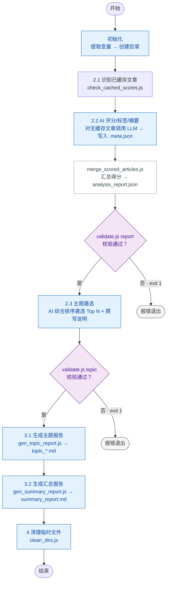

# 微信公众号文章选题与报告生成

读取本地 Markdown 文章文件，经 AI 评分、标签提取与主题遴选，最终输出主题报告与汇总报告。

## 输入

技能接受两个 JSON 数据作为输入：

### 1) files

```json
[
  {
    "path": "D:/save/2247502767_1_20260608_某公众号_文章标题.md"
  }
]
```

| 字段 | 类型 | 必填 | 说明 |
|------|------|------|------|
| `path` | string | 是 | 文章 Markdown 文件的**绝对路径** |

`files` 数组中的每篇文章将在本地查找同名的 `.meta.json` 缓存文件（`{path}.meta.json` 即 `path` 的 `.md` 替换为 `.meta.json`）。若有缓存则跳过 AI 评分步骤。

为获得更丰富的报告内容，建议同时提供元数据：

```json
[
  {
    "path": "D:/save/article.md",
    "title": "文章标题",
    "account_name": "公众号名称",
    "account_category": "AI",
    "url": "https://mp.weixin.qq.com/..."
  }
]
```

未提供时脚本会从文件名中解析（gather 命名规约 `{aid}_{yyyyMMdd}_{account_name}_{title}.md`）。

### 2) settings

```json
{
  "topic_count": 3,
  "topic_selection_guidance": "关注大模型落地应用",
  "output": "D:/output/reports",
  "temp": "D:/temp/analyze"
}
```

| 字段 | 类型 | 必填 | 默认值 | 说明 |
|------|------|------|--------|------|
| `topic_count` | int | 否 | `3` | 遴选主题数量 |
| `topic_selection_guidance` | string | 否 | `""` | AI 遴选主题时的方向指导 |
| `output` | string | 是 | — | **报告输出目录**，最终报告写入此目录 |
| `temp` | string | 否 | `.temp/{GUID}` | 临时目录，完成后 agent 递归删除 |

## 变量定义

| 变量 | 取值 | 说明 |
|------|------|------|
| `{scripts}` | `skills/wechat-mp-analyze/scripts` | 脚本根目录 |
| `{temp}` | `settings.temp` 或 `.temp/{GUID}` | 临时文件目录 |
| `{output}` | `settings.output` | 报告输出目录 |
| `{date}` | 执行日期 `yyyyMMdd` | 用于文件名 |
| `{config-runtime}` | `{temp}/config.json` | 运行时配置，含完整输入 |

## 工作流

### 流程图



### 预置条件

| 动作 | 说明 |
|------|------|
| 提取 `{temp}`、`{output}` | 根据变量定义表 |
| 创建目录 | `{temp}/`、`{output}/{yyyyMMdd}/` |
| 写入 `{config-runtime}` | 将完整输入 JSON 写入 `{temp}/config.json` |

### 整体输入/输出

| 方向 | 文件路径 | 说明 | 上游来源 |
|------|---------|------|---------|
| 输入 | `files[].path` | 文章 Markdown 原文 | 调用者 / `wechat-mp-gather` |
| 输出 | `{temp}/analysis_report_{yyyyMMdd}.json` | AI 评分、标签与摘要 | 2.2 |
| 输出 | `{temp}/analysis_topic_{yyyyMMdd}.json` | AI 遴选的主题及推理性说明 | 2.3 |
| 输出 | `{output}/{yyyyMMdd}/topic_*.md` | 每主题一份独立分析报告 | 3.1 |
| 输出 | `{output}/{yyyyMMdd}/summary_report_{yyyyMMdd}.md` | 汇总所有主题和文章的最终报告 | 3.2 |

### 2.1 识别已缓存文章

**输入/输出**

| 方向 | 文件路径 | 说明 | 上游来源 | 下游消费 |
|------|---------|------|---------|---------|
| 输入 | `{config-runtime}`（`files[]` 字段） | 待分析文章列表 | 调用者 | — |
| 输出 | `{temp}/articles_to_score_{yyyyMMdd}.json` | **仅无 `.meta.json` 的文章** | — | 2.2（AI 评分） |

运行 `check_cached_scores.js`，读取 `config-runtime` 中的 `files[]` 逐篇比对 `.meta.json` 是否存在：

```
node {scripts}/check_cached_scores.js \
  {config-runtime} \
  {temp}
```

**映射规则**：对 `files[]` 中每个 `{path}`，查找 `{path}.meta.json`（即 `{path}` 替换 `.md` 为 `.meta.json`）。有缓存跳过，无缓存写入 `articles_to_score_{yyyyMMdd}.json`。

输出中每篇文章包含从文件名解析的元数据：

```json
{
  "articles": [
    {
      "file_path": "2247502767_1_20260608_某公众号_文章标题.md",
      "aid": "2247502767_1",
      "title": "文章标题",
      "account_name": "某公众号",
      "account_category": "未分类"
    }
  ]
}
```

### 2.2 AI 评分、标签提取与摘要（增量打分）

**输入/输出**

| 方向 | 文件路径 | 说明 | 上游来源 | 下游消费 |
|------|---------|------|---------|---------|
| 输入 | `files[].path` | 每篇文章的 Markdown 原文 | 调用者 | — |
| 输入 | `{temp}/articles_to_score_{yyyyMMdd}.json` | 待 AI 评分的新文章清单 | 2.1 | — |
| 输出（每篇） | `{path}.meta.json` | 新增评分缓存（score + tags + summary） | — | 汇总 |
| 输出 | `{temp}/analysis_report_{yyyyMMdd}.json` | 汇总后的完整评分数据 | — | 2.3、3.1/3.2 |

**防重复打分**：`articles_to_score` 仅包含无缓存的新文章，已有缓存的自动跳过。

**评分维度**：时效性、原创性、信息密度、影响力、相关性。

**操作步骤**：

1. 读取 `articles_to_score_{yyyyMMdd}.json`
2. 逐篇读取 `.md`，调用 LLM 评分（1-5）+ 提取标签（2-5 个）+ 提取核心摘要（1-2 句）
3. 在 `{path}.meta.json` 写入评分缓存：

```json
{
  "score": 4,
  "tags": ["大模型", "开源", "MoE"],
  "summary": "MoE架构通过稀疏激活在同等算力下实现更大模型容量。"
}
```

4. 执行 `merge_scored_articles.js` 汇总：

```
node {scripts}/merge_scored_articles.js \
  {config-runtime} \
  {temp}/analysis_report_{yyyyMMdd}.json
```

5. 校验输出：`node {scripts}/validate.js report {temp}/analysis_report_{yyyyMMdd}.json`

### 2.3 主题遴选

**输入/输出**

| 方向 | 文件路径 | 说明 | 上游来源 | 下游消费 |
|------|---------|------|---------|---------|
| 输入 | `{temp}/analysis_report_{yyyyMMdd}.json` | AI 评分、标签、摘要、`topic_count`、`topic_selection_guidance`（若配置） | 2.2 | — |
| 输出 | `{temp}/analysis_topic_{yyyyMMdd}.json` | AI 遴选的主题及遴选理由 | — | 3.1 |

AI 读取 `analysis_report`，按以下算法筛选主题：

1. **标签排名**：综合得分 = `文章数×1 + 覆盖公众号数×2 + 平均评分×1`
2. **遴选 Top N**：取前 `topic_count` 个标签作为主题
3. **撰写遴选理由**：结合摘要和评分，说明为何该方向值得作为独立主题
4. **撰写主题概述与洞察**：字数约束 `topic_overview` 80-200 字，`reasoning` 50-150 字，每条 `insight` 的 `detail` 100-300 字

若配置了 `topic_selection_guidance`，AI 应优先关注指定领域。

输出格式：

```json
{
  "topics": [
    {
      "name": "大模型",
      "reasoning": "...",
      "topic_overview": "可选，80-200 字",
      "insights": [
        { "title": "洞察标题", "detail": "洞察详细内容" }
      ]
    }
  ]
}
```

写入后校验：`node {scripts}/validate.js topic {temp}/analysis_topic_{yyyyMMdd}.json`

### 3.1 生成主题报告

根据 `analysis_topic.json` 为每个主题生成独立的 Markdown 报告：

```
node {scripts}/gen_topic_report.js \
  {temp}/analysis_report_{yyyyMMdd}.json \
  {output}/{yyyyMMdd} \
  {config-runtime} \
  {temp}/analysis_topic_{yyyyMMdd}.json
```

脚本逻辑：标题去重（编辑距离 > 0.8）→ 评分关联 → 按主题匹配文章 → 填充 `template_topic.md` 模板 → 输出 `topic_{标签名}.md`。

> 文章 `.md` 原文路径由 `analysis_report` 中的 `file_path` 字段定位，脚本自动到对应目录读取。

### 3.2 生成汇总报告

```
node {scripts}/gen_summary_report.js \
  {temp}/analysis_report_{yyyyMMdd}.json \
  {output}/{yyyyMMdd} \
  {config-runtime} \
  {yyyyMMdd}
```

输出 `summary_report_{dateSuffix}.md`。

### 4 清理临时文件

```
node {scripts}/clean_dirs.js "{temp}"
```

> ⚠️ 脚本会校验目标目录是否在 `{temp}` 范围内，防止误删。

### 完整执行步骤

1. **初始化**：若 `{temp}` 未指定，自动创建 `.temp/{GUID}`；创建 `{output}/{yyyyMMdd}/`；将完整输入写入 `{temp}/config.json`
2. **2.1**：运行 `check_cached_scores.js` → 产出 `articles_to_score_{yyyyMMdd}.json`
3. **2.2**：AI 对无缓存文章评分/标签/摘要 → 写入 `{path}.meta.json` → 运行 `merge_scored_articles.js` → 产出 `analysis_report_{yyyyMMdd}.json`
4. **2.3**：AI 读取 `analysis_report` 遴选主题 → 产出 `analysis_topic_{yyyyMMdd}.json`
5. **3.1**：运行 `gen_topic_report.js` → 产出 `topic_*.md`
6. **3.2**：运行 `gen_summary_report.js` → 产出 `summary_report_{yyyyMMdd}.md`
7. **4**：清理 `{temp}/` 目录
8. **返回**：agent 将 `{output}/{yyyyMMdd}/` 下的所有报告路径返回给调用者

### 错误处理

| 场景 | 处理 |
|------|------|
| AI 评分失败 | 跳过该篇，`merge` 标记为 `score: null` |
| 标签不足 | 以实际标签数作为主题数，不填充 |
| 模板渲染失败 | 跳过该模板，不影响其他报告 |
| 主题报告为空 | 跳过该主题 |
| 清理时目录不存在 / 文件占用 | 跳过并记录警告 |
