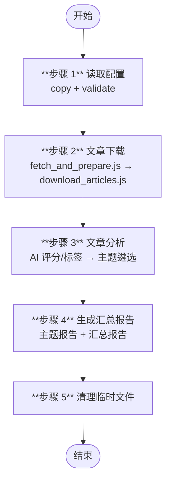
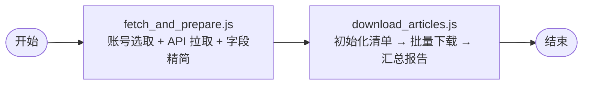

# 微信公众号文章抓取与报告生成 (wechat-mp-articles)

从配置的公众号抓取文章，经 AI 评分、标签提取与主题遴选，生成 Markdown 图文报告。全部由 Node.js 脚本驱动，AI 仅用于内容理解和结构数据生成。

## 快速开始

准备配置文件（JSON），填入目标公众号信息，通过命令行参数传递给技能：

```json
{
  "accounts": [
    {
      "name": "公众号名称",
      "fake_id": "公众号fake_id（通过 wechat-mp-generation_search_account 获取）",
      "category": "分类标签",
      "enabled": true
    }
  ],
  "settings": {
    "name": "mp-articles",
    "days_to_filter": 3,
    "max_articles_per_account": 5,
    "max_accounts": 5,
    "topic_count": 3
  }
}
```

在 opencode 中输入触发指令，例如：
- "从配置的公众号抓取文章并生成报告"
- "拉取微信公众号最新文章汇总"

## 工作流



| 步骤 | 说明 | 脚本/手段 | 产出 |
|------|------|-----------|------|
| 1 | 复制 config → `{config-runtime}`，校验字段完整性 | `validate.js` | `{config-runtime}` |
| 2 | 选取当天公众号 → 拉取文章列表 → 下载 Markdown → 生成汇总报告 | `fetch_and_prepare.js` + `download_articles.js` | `*.md` / `download_report.json` |
| 3 | AI 评分、标签提取与主题遴选 | LLM + `merge_analysis_meta.js` | `analysis_report.json` / `analysis_topic.json` |
| 4 | 生成主题报告与汇总报告 | `gen_topic_report.js` + `gen_summary_report.js` | `topic_*.md` / `summary_report.md` |
| 5 | 清理临时文件 | `clean_dirs.js` | — |

## 步骤 2 内部流程



- **`fetch_and_prepare.js`**：内置日期轮换算法自动选取当天公众号，通过 HTTP API 拉取文章列表，完成过滤、字段精简和文件名生成，一步输出清洗后的 JSON
- **`download_articles.js`**：初始化下载清单，通过 HTTP API 批量下载 Markdown 原文（含校验重试），下载完成后自动扫描生成汇总报告

## 关键变量

| 变量 | 说明 |
|------|------|
| `{config}` | 用户提供的配置文件路径（命令行参数） |
| `{config-runtime}` | `{temp-data}/config.json`，步骤 1 复制的运行时副本 |
| `{profile}` | 取自 `settings.name`，用于输出目录前缀 |
| `{temp-data}` | `.temp/{profile}/~data`，临时 JSON 数据 |
| `{download-articles}` | `.temp/{profile}/wechat_articles`，下载文章存放目录 |
| `{output}` | `output/{profile}`，报告输出目录 |

## 配置字段

| 参数 | 类型 | 默认值 | 说明 |
|------|------|--------|------|
| `accounts[].name` | string | 必填 | 公众号显示名称 |
| `accounts[].fake_id` | string | 必填 | 公众号唯一标识 |
| `accounts[].category` | string | 无 | 分类标签，仅用于组织管理 |
| `accounts[].enabled` | bool | `true` | 设为 `false` 则跳过 |
| `settings.name` | string | 空 | 输出目录名称前缀 |
| `settings.days_to_filter` | int | `3` | 筛选最近 N 天的文章 |
| `settings.max_articles_per_account` | int | `5` | 每号最多拉取文章数 |
| `settings.max_accounts` | int | `5` | 每次最多抓取的公众号数量 |
| `settings.topic_count` | int | `3` | 遴选主题数量 |

## 环境变量

| 变量 | 说明 |
|------|------|
| `PB_WECHAT_MP_API_BASE` | 微信公众号 HTTP API 基础地址 |
| `PB_WECHAT_MP_AUTH_KEY` | API 认证密钥（X-Auth-Key 头） |

## 账号轮换算法

`fetch_and_prepare.js` 内置分组分片 + 逐周期确定性洗牌策略：

- 全部 `enabled` 公众号按 `name` 字典序排序
- 分成 `ceil(N/M)` 组，每组 `max_accounts` 个
- 以 `2020-01-01` 为纪元计算天数，按周期索引切换分组，跨周期 Fisher-Yates 洗牌
- 保证 `ceil(N/M)` 天内每个账号恰好被拉到一次，且相邻周期分组不固定

## 前置依赖

- Node.js >= 18
- 全局安装：`npm i -g axios fastmcp zod`
- 微信公众号 HTTP API 服务（`PB_WECHAT_MP_API_BASE`）

## 注意事项

- `fake_id` 需通过 `wechat-mp-generation_search_account`（MCP 工具）搜索获知，配置后无需再依赖 MCP
- 技能自身不再依赖 MCP 进行拉取和下载，全部通过 HTTP API 直连
- 下载校验：Markdown 文件必须包含 `![cover_image]` 标记才算有效
- 网络/IO 错误间隔 10s 重试，最多 3 次；内容无效删除重试，最多 2 次
