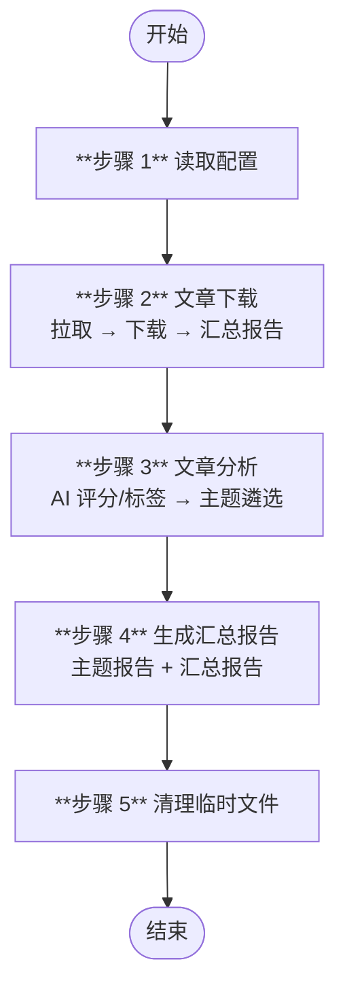

# 微信公众号文章抓取与报告生成

从配置的公众号抓取文章，按时间筛选后下载为 Markdown，经 AI 评分、标签提取与主题遴选，最终输出主题报告与汇总报告。全部由脚本驱动（Node.js），AI 仅用于内容理解和结构数据生成。

## 前置依赖

- `fetch_and_prepare.js` — 通过 HTTP API (`{PB_WECHAT_MP_API_BASE}/api/public/v1/article`) 批量拉取文章列表，自动完成字段精简和文件名生成（替代 MCP 拉取通道 + prepare_article_list.js）
- `download_articles.js` — 通过 HTTP API (`{PB_WECHAT_MP_API_BASE}/api/public/v1/download`) 批量下载文章 Markdown 内容，自动完成清单初始化、下载校验和汇总报告生成（替代 MCP 下载通道 + gen_download_list.js + gen_download_report.js）

## 核心概念

| 概念 | 来源 | 说明 |
|------|------|------|
| **分类** `Category` | 用户在配置文件中手工指定 | 公众号的组织标签，与最终主题无关 |
| **标签** `Tag` | AI 逐篇提取（步骤 3.2） | 每篇文章 2-5 个关键词 |
| **主题** `Topic` | AI 按算法遴选（步骤 3.3） | 综合标签频率 + 公众号覆盖数 + 平均评分，取 Top N |

## 配置

> ⚠️ **`{config}` 必须由用户在命令行参数中指定**，技能本身不提供默认配置文件。

重点规则：
- `{config}` 是用户提供的 JSON 配置文件路径，步骤 1 将其复制到 `{config-runtime}`（即 `{temp-data}/config.json`），后续步骤统一读取此副本
- 从 `{config}` 的 `settings.name` 字段提取 `{profile}`，该值决定所有运行时目录的前缀（见下方「变量定义」）
- 配置字段的完整定义与校验规则见 [step1.md](steps/step1.md)

## 变量定义

| 变量 | 类型 | 默认值 | 说明 |
|------|------|--------|------|
| `{profile}` | 值 | `settings.name` | 配置名称（从 `{config}` 中提取），用于路径前缀 |
| `{skill}` | 目录 | `skills/wechat-mp-articles` | 技能根目录 |
| `{download-articles}` | 目录 | `.temp/{profile}/wechat_articles` | 下载文章存放目录 |
| `{output}` | 目录 | `output/{profile}` | 报告输出目录 |
| `{temp-scripts}` | 目录 | `.temp/{profile}/~scripts` | 管线运行期间 AI 动态创建的临时脚本存放处，避免在项目其他目录生成文件 |
| `{temp-data}` | 目录 | `.temp/{profile}/~data` | 临时 JSON 数据 |
| `{config}` | 文件路径 | **无默认值，用户必须在命令行参数中指定** | 原始配置文件，仅步骤 1 使用 |
| `{config-runtime}` | 文件路径 | `{temp-data}/config.json` | 运行时配置副本，步骤 1 从 `{config}` 复制至此，后续步骤统一读取 |

## 工作流一览



## 文档地图

| 步骤 | 标题 | 内容概要 | 输入 | 输出 |
|------|------|---------|------|------|
| [**Step 1**](steps/step1.md) | 读取配置 | 加载用户配置 → 复制到 `{config-runtime}` → 校验 | `{config}` | `{config-runtime}`（→ Step 2/3/4） |
| [**Step 2**](steps/step2.md) | 文章下载 | 拉取 → 下载 → 汇总报告 | `{config-runtime}`（来自 Step 1） | `*.md`（→ Step 3/4）、`download_report.json`（→ Step 3） |
| [**Step 3**](steps/step3.md) | 文章分析 | `check_cached_scores.js` 拆分已/未评分文章（3.1）→ AI 对无缓存文章增量打分（3.2） → `merge_scored_articles.js` 汇总评分与元数据 → 主题遴选 + 推理性说明（3.3） | `*.md`、`download_report_{yyyyMMdd}.json`（均来自 Step 2） | `{temp-data}/articles_to_score_{yyyyMMdd}.json`、`*.meta.json`、`analysis_report_{yyyyMMdd}.json`、`analysis_topic_{yyyyMMdd}.json` |
| [**Step 4**](steps/step4.md) | 生成汇总报告 | 主题报告 + 汇总报告 | `analysis_report.json`、`analysis_topic.json`（来自 Step 3）、`*.md`（来自 Step 2） | `topic_*.md` / `summary_report.md`（最终产物） |
| [**Step 5**](steps/step5.md) | 清理临时文件 | 删除 `{temp-scripts}/` 和 `{temp-data}/` | `{temp-scripts}/`、`{temp-data}/` | 无（流程终点） |

## 技能输入与输出

| 方向 | 说明 |
|------|------|
| **输入** | `{config}` — 用户提供的 JSON 配置文件（命令行参数指定） |
| **输出** | `{output}/{profile}/{yyyyMMdd}/topic_*.md` — 主题报告 |
| **输出** | `{output}/{profile}/{yyyyMMdd}/summary_report_{yyyyMMdd}.md` — 汇总报告 |

## 输出目录结构

```
{output}/
└── {profile}/
    └── {yyyyMMdd}/
        ├── summary_report_{yyyyMMdd}.md    # 汇总报告（步骤 4.2）
        ├── topic_{标签名1}.md               # 主题报告（步骤 4.1）
        ├── topic_{标签名2}.md
        └── topic_{标签名3}.md               # 数量由 topic_count 控制

{download-articles}/
├── {aid}_{yyyyMMdd}_{公众号名称}_{title}.md              # 已下载的文章（步骤 2.2）
├── {aid}_{yyyyMMdd}_{公众号名称}_{title}.meta.json        # 文章评分缓存（score + tags + summary）（步骤 3.1 检查/3.2 写入）
├── download_report_{yyyyMMdd}.json                     # 下载汇总报告（步骤 2.2）
├── analysis_report_{yyyyMMdd}.json                     # AI 评分、标签与摘要（步骤 3.2）
├── analysis_topic_{yyyyMMdd}.json                      # AI 遴选主题及推理性说明（步骤 3.3）
└── ...

{temp-data}/
├── config.json                                         # 运行时配置（步骤 1）
├── article_list_{yyyyMMdd}.json                        # 清洗后的文章元数据（步骤 2.1）
├── articles_to_score_{yyyyMMdd}.json                   # 待 AI 评分的新文章清单（步骤 3.1）
├── list_pending.txt                                    # 内部状态：待下载 aid（步骤 2.2）
├── list_failed.txt                                     # 内部状态：下载失败记录（步骤 2.2）
└── ...
```
