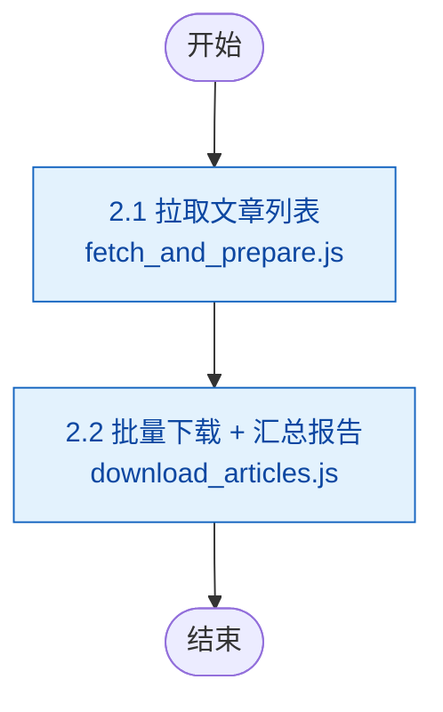

# 步骤 2：文章下载

> 本文档为 [SKILL.md](../SKILL.md) 的步骤详情子文档。变量定义见 [SKILL.md#变量定义](../SKILL.md#变量定义)。

合并完成拉取文章列表、逐篇下载文章、生成下载汇总报告三个子任务。

> ⚠️ **拉取列表与下载内容均改为脚本直接通过 HTTP API 获取**，不再走 MCP 通道，以节省 token 并提升性能。

### 步骤整体输入/输出

| 方向 | 文件路径 | 说明 | 下游消费 |
|------|---------|------|---------|
| 输入 | `{config-runtime}` | 公众号配置与全局设置（来自步骤 1） | 2.1 |
| 输出 | `{download-articles}/*.md` | 文章 Markdown 原文（每篇一篇） | 步骤 3.1、步骤 4.1/4.2 |
| 输出 | `{download-articles}/download_report_{yyyyMMdd}.json` | 下载结果汇总 JSON（含文章元数据） | 步骤 3.1（merge_analysis_meta） |

### 子流程



## 2.1 拉取文章列表

### 输入/输出

| 方向 | 文件路径 | 说明 | 下游消费 |
|------|---------|------|---------|
| 输出 | `{temp-data}/article_list_{yyyyMMdd}.json` | 清洗后的文章元数据（keyed by aid，含 file_name） | 步骤 2.2 |

运行 `fetch_and_prepare.js` 脚本，内置日期轮换算法自动选取当天公众号，再通过 HTTP API 拉取文章。脚本一次性完成账号选取、API 调用、过滤（`is_deleted`、`update_time`）、账号信息补齐、字段精简和 `file_name` 生成，输出清洗后的 JSON：

```
node {skill}/scripts/fetch_and_prepare.js \
  {config-runtime} \
  {date} \
  {temp-data}/article_list_{yyyyMMdd}.json
```

其中 `{date}` 为当天日期，格式 `YYYY-MM-DD`（如 `2026-06-18`）。

**账号选取算法**说明：采用分组分片 + 逐周期洗牌策略，保证 `ceil(N/M)` 天内每个账号恰好被拉到一次。详见 `select_accounts.js` 旧版文档。核心参数取自 `{config-runtime}` 的 `settings.max_accounts`。

输出格式（keyed by `aid`，仅保留 `aid`, `title`, `cover`, `link`, `digest`, `update_time`, `appmsgid`, `itemidx`, `create_time`, `fake_id`, `account_name`, `account_category`, `file_name`）：

```json
{
  "aid_12345_1": {
    "aid": "12345_1",
    "title": "...",
    "digest": "...",
    "link": "...",
    "create_time": 1780899900,
    "update_time": 1780899900,
    "appmsgid": 12345,
    "itemidx": 1,
    "cover": "...",
    "fake_id": "...",
    "account_name": "公众号名称",
    "account_category": "分类标签",
    "file_name": "aid_12345_1_20260611_公众号名称_文章标题.md"
  },
  ...
}
```

## 2.2 批量下载 + 校验 + 汇总报告

### 输入/输出

| 方向 | 文件路径 | 说明 | 上游来源 | 下游消费 |
|------|---------|------|---------|---------|
| 输入 | `{temp-data}/article_list_{yyyyMMdd}.json` | 待下载文章元数据（含预生成 `file_name`） | 2.1 | — |
| 输出 | `{temp-data}/list_pending.txt` | 内部状态：待下载 aid，逐篇移除 | — | — |
| 输出 | `{temp-data}/list_failed.txt` | 内部状态：下载失败记录 | — | — |
| 输出（每篇） | `{download-articles}/{file_name}` | 下载的 Markdown 原文 | — | 步骤 3.1、步骤 4.1/4.2 |
| 输出 | `{download-articles}/download_report_{yyyyMMdd}.json` | 下载结果汇总 JSON | — | 步骤 3.1（merge_analysis_meta） |

运行 `download_articles.js` 脚本，单次完成清单初始化、批量下载和汇总报告生成：

```
node {skill}/scripts/download_articles.js \
  {temp-data}/article_list_{yyyyMMdd}.json \
  {download-articles} \
  {temp-data}
```

**脚本逻辑**：

1. **初始化清单**：从 `article_list_{yyyyMMdd}.json` 读取所有 aid，写入 `{temp-data}/list_pending.txt`；初始化空的 `{temp-data}/list_failed.txt`
2. **批量下载**：从 `list_pending.txt` 读取 aid，逐篇处理：
   - 从 `article_list_{yyyyMMdd}.json` 获取 `link` 和 `file_name`
   - 检查 `{download-articles}/{file_name}` **是否已存在且内容有效**（含 `![cover_image]`），若有效则跳过
   - 若文件不存在或无效，通过 HTTP API 下载 Markdown 内容
   - 将内容写入 `{download-articles}/{file_name}`
3. **内联校验与重试**：

| 状态 | 含义 | 处理方式 |
|--------|------|---------|
| 有效（含 `![cover_image]`） | 下载成功 | 从 `list_pending.txt` 移除，继续下一篇 |
| 文件缺失 / 未知 aid | 网络/IO 错误 | 等待 10 秒后重试，最多 3 次 |
| 文件存在但内容无效 | 内容校验失败 | 删除文件、重新下载并校验，最多 2 次 |

   **重试策略**：
   - **文件已存在且有效**：跳过下载，直接标记为成功
   - **HTTP/网络错误**：等待 10 秒后重试，最多 3 次。仍失败则记入 `list_failed.txt`（`{aid}|网络/IO错误`）
   - **内容无效**：删除无效文件，重新下载并校验，最多 2 次。仍失败则记入 `list_failed.txt`（`{aid}|内容校验失败`）
   - **成功**：从 `list_pending.txt` 移除

4. **生成汇总报告**：全部处理完毕后，扫描实际下载情况，输出 `download_report_{yyyyMMdd}.json`

> 文件名已在 2.1 步骤由 `fetch_and_prepare.js` 预生成写入 `file_name` 字段。规则：`{aid}_{yyyyMMdd}_{account_name}_{title}.md`，其中 `account_name` 和 `title` 做 sanitize（`\ / : * ? " < > |` 替换为 `_`，截断前 80 字符）。

输出 JSON 结构：

```json
{
  "timestamp": "2026-06-10 10:39",
  "summary": {
    "accounts": 5,
    "qualifying_articles": 3,
    "success_count": 3,
    "fail_count": 0
  },
  "account_details": [
    {
      "name": "壹沓科技",
      "category": "供应链科技",
      "qualifying_count": 1,
      "success_count": 1,
      "fail_count": 0,
      "status": "正常"
    }
  ],
  "articles": [
    {
      "index": 1,
      "aid": "2247502767_1",
      "title": "小沓AI数字员工亮相第十二届上交会",
      "account_name": "壹沓科技",
      "account_category": "供应链科技",
      "file_path": "2247502767_1_20260608_壹沓科技_小沓AI数字员工亮相第十二届上交会.md",
      "url": "https://mp.weixin.qq.com/s/...",
      "digest": "...",
      "update_time": 1780916109,
      "download_status": "成功"
    }
  ]
}
```

`download_articles.js` 从 `list_failed.txt` 读取失败原因合并到报告，同时扫描 `{download-articles}/` 目录下的 `.md` 文件进行双重校验。

## 错误处理

- **文章拉取失败**：如果某个公众号拉取失败，跳过该公众号，在下载报告中标注"抓取失败"
- **内容下载失败**：按 2.2 重试策略处理，超过最大重试次数后记入 `list_failed.txt`，在下载报告中标注失败原因
- **完整性校验失败**：`download_articles.js` 生成报告时若发现文章元数据中存在文章没有对应文件，将其统计为失败
