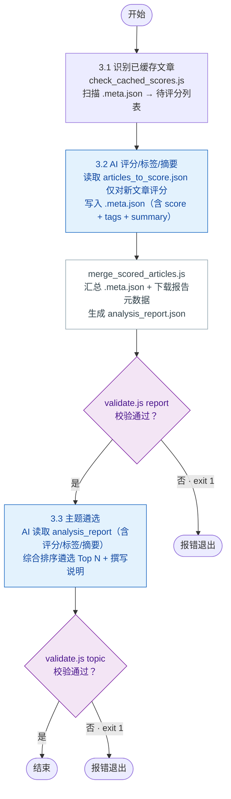

# 步骤 3：文章分析

> 本文档为 [SKILL.md](../SKILL.md) 的步骤详情子文档。变量定义见 [SKILL.md#变量定义](../SKILL.md#变量定义)。

合并完成 AI 评分与标签提取、主题遴选两个子任务。

### 步骤整体输入/输出

| 方向 | 文件路径 | 说明 | 下游消费 |
|------|---------|------|---------|
| 输入 | `{download-articles}/*.md` | 文章 Markdown 原文（每篇一篇） | 3.1 |
| 输入 | `{download-articles}/download_report_{yyyyMMdd}.json` | 下载结果汇总 JSON（含文章元数据，含失败记录） | 3.1 |
| 输出 | `{download-articles}/analysis_report_{yyyyMMdd}.json` | 完整评分结果（含本地缓存 + 新增评分 + 失败文章） | 步骤 3.3、步骤 4.1/4.2 |
| 输出 | `{download-articles}/analysis_topic_{yyyyMMdd}.json` | AI 遴选的主题及推理性说明 | 步骤 4.1 |

### 子流程



## 3.1 识别已缓存文章

### 输入/输出

| 方向 | 文件路径 | 说明 | 上游来源 | 下游消费 |
|------|---------|------|---------|---------|
| 输入 | `{download-articles}/download_report_{yyyyMMdd}.json` | 下载结果汇总 | 步骤 2.2 | — |
| 输出 | `{temp-data}/articles_to_score_{yyyyMMdd}.json` | **仅无 `.meta.json` 的文章** | — | 步骤 3.2（AI 评分） |

运行 `check_cached_scores.js`，读取 `download_report` 后逐篇比对 `.meta.json` 是否存在，拆分输出：

```
node {skill}/scripts/check_cached_scores.js \
  {download-articles}/download_report_{yyyyMMdd}.json \
  {download-articles} \
  {temp-data}
```

**映射规则**：将 `file_path` 中的 `.md` 后缀替换为 `.meta.json`，目录不变。例如：

| `.md` 文件 | 对应 `.meta.json` |
|------------|------------------|
| `2652708759_1_20260624_新智元_今天,Claude入职了!.md` | `2652708759_1_20260624_新智元_今天,Claude入职了!.meta.json` |

**拆分逻辑**：

- **有 `.meta.json`** → 已有评分缓存，跳过（无需输出）
- **无 `.meta.json`** → 写入 `articles_to_score_{yyyyMMdd}.json`，供 AI 评分

输出示例：

`articles_to_score_{yyyyMMdd}.json`：
```json
{
  "articles": [
    {
      "index": 1,
      "aid": "2247502767_1",
      "title": "...",
      "file_path": "2247502767_1_...md",
      "download_status": "成功",
      "url": "https://..."
    }
  ]
}
```

## 3.2 AI 评分、标签提取与摘要（增量打分）

### 输入/输出

| 方向 | 文件路径 | 说明 | 上游来源 | 下游消费 |
|------|---------|------|---------|---------|
| 输入 | `{download-articles}/*.md` | 每篇文章的 Markdown 原文（供 AI 阅读） | 步骤 2.2 | — |
| 输入 | `{temp-data}/articles_to_score_{yyyyMMdd}.json` | 待 AI 评分的新文章清单 | 步骤 3.1 | — |
| 输出（每篇） | `{download-articles}/{file_name.stem}.meta.json` | 新增评分文章的本地缓存（含 score + tags + summary） | — | 步骤 3.2（merge_scored_articles 汇总） |
| 输出 | `{download-articles}/analysis_report_{yyyyMMdd}.json` | 汇总后的完整评分数据 | — | 步骤 3.3、步骤 4.1/4.2 |

### 防重复打分机制

`articles_to_score_{yyyyMMdd}.json` **仅包含无 `.meta.json` 缓存的新文章**，已有缓存的文章被 `check_cached_scores.js` 自动跳过。AI 只需对此文件中的文章逐篇评分。评分完成后 `merge_scored_articles.js` 直接从目录扫描所有 `.meta.json` 文件汇总，无需中间缓存文件。

### 质量评分维度

| 维度 | 评分依据 |
|------|---------|
| **时效性** | 发布时间越接近当前，分数越高 |
| **原创性** | 原创标识、独家内容加分 |
| **信息密度** | 有效信息占比高、有数据/案例支撑加分 |
| **影响力** | 阅读量、互动量（如可用） |
| **相关性** | 与配置的分类标签匹配度 |

### 标签提取

从每篇文章中提取 2-5 个有意义的主题标签（如 `大模型`、`Agent`、`融资`、`芯片`、`开源`）。

### 核心摘要提取

为每篇文章生成 1-2 句核心摘要，概括文章的核心结论或关键信息。该摘要将存入 `.meta.json` 的 `summary` 字段，供后续主题遴选 AI 参考，使其能基于文章具体内容撰写更扎实的遴选理由和主题概述。

### 操作步骤

1. **读取待评分清单**：加载 `articles_to_score_{yyyyMMdd}.json`，其中的文章均无 `.meta.json` 缓存
2. **对新文章评分**：逐篇读取 `.md` 原文，调用 LLM 评分 + 提取标签 + 提取核心摘要
3. **写入本地缓存**：每篇评分完成后，在与 `.md` 同目录下创建 `.meta.json` 文件：

```json
{
  "score": 4,
  "tags": ["大模型", "开源", "MoE"],
  "summary": "MoE架构通过稀疏激活在同等算力下实现更大模型容量，成为主流大模型的核心选择。"
}
```

4. **运行合并脚本**：AI 评分完毕后，执行 `merge_scored_articles.js` 直接扫描 `{download-articles}` 目录下的所有 `.meta.json` 文件进行汇总：

```
node {skill}/scripts/merge_scored_articles.js \
  {download-articles}/download_report_{yyyyMMdd}.json \
  {download-articles} \
  {download-articles}/analysis_report_{yyyyMMdd}.json \
  {config-runtime}   # 可选，传入后 topic_selection_guidance 合并到 analysis_report 顶层
```

该脚本完成：
   - 遍历 `download_report` 的所有文章
   - 扫描同目录下的 `.meta.json` 文件获取 `score`、`tags`、`summary`
   - 无 `.meta.json` 或下载失败的文章标记 `score: null`、`tags: []`、`summary: null`、`download_status: "失败"`
   - 合并元数据（标题、公众号名、分类等）生成完整的 `analysis_report`

5. **校验输出**：

```
node {skill}/scripts/validate.js report {download-articles}/analysis_report_{yyyyMMdd}.json
```

校验通过输出 `Valid: analysis_report_{yyyyMMdd}.json (N article(s))`，失败 exit 1。

### 输出示例

```json
{
  "timestamp": "2026-06-09 15:10",
  "topic_count": 3,
  "topic_selection_guidance": "侧重国产替代和开源生态方向",
  "articles": [
    {
      "link": "https://mp.weixin.qq.com/s/xxx",
      "score": 4,
      "tags": ["大模型", "开源", "MoE"],
      "summary": "MoE架构通过稀疏激活在同等算力下实现更大模型容量，成为主流大模型的核心选择。",
      "title": "某篇文章标题",
      "account_name": "某公众号",
      "account_category": "科技",
      "digest": "文章摘要...",
      "update_time": 1780916109,
      "file_path": "aid_xxx_20260608_某公众号_某篇文章标题.md",
      "aid": "xxx_1"
    },
    {
      "link": "https://mp.weixin.qq.com/s/yyy",
      "score": null,
      "tags": [],
      "summary": null,
      "download_status": "失败",
      "title": "下载失败的文章标题",
      "account_name": "某公众号",
      "account_category": "科技",
      "digest": "摘要...",
      "update_time": 1780916109,
      "file_path": null,
      "aid": "yyy_1"
    }
  ]
}
```

## 3.3 主题遴选

### 输入/输出

| 方向 | 文件路径 | 说明 | 上游来源 | 下游消费 |
|------|---------|------|---------|---------|
| 输入 | `{download-articles}/analysis_report_{yyyyMMdd}.json` | AI 评分、标签、摘要、`topic_count`、`topic_selection_guidance`（若配置） | 步骤 3.2 | — |
| 输出 | `{download-articles}/analysis_topic_{yyyyMMdd}.json` | AI 遴选的主题及遴选理由 | — | 步骤 4.1 |

AI 读取 `analysis_report_{yyyyMMdd}.json`（含每篇文章的评分、标签和核心摘要），按以下算法筛选主题并撰写推理性说明：

若 `analysis_report.json` 顶层包含 `topic_selection_guidance` 字段（来自配置 `settings.topic_selection_guidance`），AI 应将其作为遴选方向的额外依据，优先关注指导中指定的领域。

1. **标签排名**：对每个标签计算综合得分 `文章数×1 + 覆盖公众号数×2 + 平均质量评分×1`，公众号多样性权重最高
2. **遴选 Top N**：按得分降序取前 `topic_count` 个标签作为最终主题（值来自 `analysis_report.json` 顶层）。主题名直接使用标签名
3. **撰写遴选理由**：对每个选中的主题，结合文章的核心摘要、覆盖面、评分等信息，用一段推理文字说明为何该方向值得作为独立主题
4. **撰写主题概述与洞察**：基于各篇文章的 `summary` 内容，为主题撰写更丰富的 `topic_overview` 和 `insights`，避免泛泛而谈。字数约束：`topic_overview` 80-200 字，`reasoning` 50-150 字，每条 `insight` 的 `detail` 100-300 字

输出格式：

```json
{
  "topics": [
    {
      "name": "大模型",
      "reasoning": "本周3篇文章聚焦大模型开源生态（Claude新版本、Llama 4发布），覆盖2个不同公众号，平均评分4.3，信息密度高且时效性强",
      "topic_overview": "可选，80-200 字，AI 撰写的主题概述段落，比自动生成的更丰富",
      "insights": [
        { "title": "可选，洞察标题", "detail": "可选，洞察详细内容" }
      ]
    }
  ]
}
```

AI 写入后运行 `validate.js` 校验文件名与数据结构：

```
node {skill}/scripts/validate.js topic {download-articles}/analysis_topic_{yyyyMMdd}.json
```

校验通过输出 `Valid: analysis_topic_{yyyyMMdd}.json (N topic(s))`，失败 exit 1 并列出具体问题。

> `topic_overview` 和 `insights` 可选；若未提供，`gen_topic_report.js` 自动生成默认概述，洞察留空。该文件由 AI 写入，步骤 4.1 的 `gen_topic_report.js` 读取（必需）。

## 错误处理

- **AI 评分失败**：单篇文章评分超时或 API 异常时，跳过该篇评分，不写入 `.meta.json`；`merge_scored_articles.js` 会将其标记为 `score: null`
- **文章下载失败**：由 `merge_scored_articles.js` 自动识别并标记 `score: null`、`tags: []`、`download_status: "失败"`，汇总报告中原样显示（评分显示为 "-"）
- **标签数量不足**：当有效标签数少于 `${topic_count}` 时，以实际标签数作为主题数，不填充空主题
- **已有缓存的新文章被重新下载**：若某篇文章因内容更新被重新下载，其 `.meta.json` 仍然存在，`check_cached_scores.js` 会跳过该篇，不会触发重复评分。如需强制刷新评分，删除对应的 `.meta.json` 文件即可
