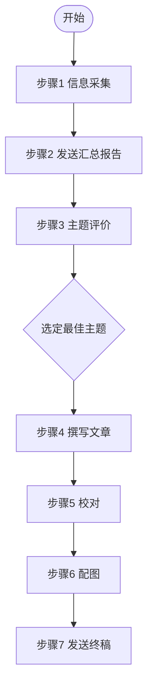

# MP 自动化管线

## 变量定义

| 变量 | 来源 | 说明 |
|------|------|------|
| `{profile}` | `config.json` → `settings.name` | 配置名称，用于区分不同配置的输出目录前缀 |
| `{date}` | 执行日期 | 格式 `yyyyMMdd`，如 `20260616` |
| `{output}` | 输出根目录 | `output/{profile}/{date}` |
| `{topic}` | 步骤 3 选中的主题名称 | 用于输出文件命名，如 `agi_draft.md` |
| `{temp-data}` | 中间数据目录 | `.temp/{profile}/~data` | 非最终产出的中间文件均存放于此 |
| `{temp-scripts}` | 脚本输出目录 | `.temp/{profile}/~scripts` | 运行期脚本均存放于此 |
| `{config-runtime}` | 运行时配置 | `{temp-data}/config.json` | 步骤 1 从原始 config 复制至此，后续统一读取（含 email 字段） |
| `{email}` | 收件地址 | `{config-runtime}` → `settings.email` | 步骤 2 发送汇总报告、步骤 7 发送终稿的目标邮箱 |

## 流程图

## 步骤详情

### 步骤 1：抓取与遴选

| | |
|------|------|
| **执行者** | `gatherer` |
| **说明** | 根据 `config.json` 使用技能 `wechat-mp-articles` 抓取公众号文章，生成汇总报告和 AI 遴选主题 |
| **输入** | `config.json` |
| **输出 (1)** | `{output}/summary_report.md` |
| **输出 (2)** | `{output}/topic_*.md` |

### 步骤 2：发送汇总报告

| | |
|------|------|
| **执行者** | `writer` |
| **说明** | 使用技能 `markdown-email` 将 `{output}/summary_report.md` 发送到 `{email}`，邮件标题为 `资讯汇总 - {profile} - {date}` |
| **输入** | `{output}/summary_report.md` |
| **输出** | 已发送的汇总报告邮件（标题：`资讯汇总 - {profile} - {date}`） |

### 步骤 3：主题评价

| | |
|------|------|
| **执行者** | `writer` → `commentator-*` |
| **说明** | writer 调用 5 位独立评论员对遴选主题逐维打分，收集评分后选定最佳主题 |
| **输入** | `{output}/topic_*.md` |
| **输出 1** | `{output}/commentary.md` — 各主题打分情况（按 `templates/mp-auto-pipeline/template_commentary.md` 渲染） |
| **输出 2** | `{output}/selected-topic.md` — 选中的主题、中选理由、相关文章列表含本地路径（按 `templates/mp-auto-pipeline/template_selected-topic.md` 渲染） |

### 步骤 4：撰写文章

| | |
|------|------|
| **执行者** | `writer` |
| **说明** | 根据选中的主题，通过 `web-search` 搜索补充素材，结合相关文章编写公众号文章；在需要配图的位置插入 `[图：图片说明]` 标记，供步骤 6 配图时使用。**配图原则**：除封面首图外，文中插图严格控制在 **1-2 张**，仅在关键位置（数据对比、流程示意、核心观点可视化）插图。**图片提示词约束**：`[图：...]` 内的图片说明文字即 AI 生图的提示词依据，须同时满足两条约束——(1) **不少于 30 字**，确保画面要素完整；(2) **不超过 120 字**，避免冗余导致生图模型超时或偏移。writer 需在撰写时自行掐头去尾、提炼核心描述 |
| **输入 (1)** | `{output}/selected-topic.md` |
| **输入 (2)** | 步骤 1 下载的公众号文章原文（`{output}/../*.md`） |
| **输入 (3)** | `web-search` 搜索补充素材的返回结果 |
| **输出** | `{output}/{topic}_draft.md` |

### 步骤 5：校对

| | |
|------|------|
| **执行者** | `writer` → `proofreader` |
| **说明** | proofreader 进行敏感词检查、拼写修正、语法复核、逻辑检查，**并校验 `[图：...]` 标记内的说明文字字数是否在 30-120 字范围内**，越界则提示 writer 修正 |
| **输入** | `{output}/{topic}_draft.md` |
| **输出** | `{output}/{topic}_proofed.md` |

### 步骤 6：插图

| | |
|------|------|
| **执行者** | `writer` → `illustrator` |
| **说明** | illustrator 根据 `[图：图片说明]` 标记生成封面首图和 **1-2 张**文中配图，writer 嵌入文章 |
| **输入** | `{output}/{topic}_proofed.md` |
| **输出** | `{output}/{topic}_final.md`（嵌入图片 URL） |

### 步骤 7：发送终稿

| | |
|------|------|
| **执行者** | `writer` |
| **说明** | 使用技能 `markdown-email` 将 `{output}/{topic}_final.md` 发送到 `{email}`，邮件标题为 `{topic} - {date}` |
| **输入** | `{output}/{topic}_final.md` |
| **输出** | 已发送的终稿邮件（标题：`{topic} - {date}`，正文含配图） |
