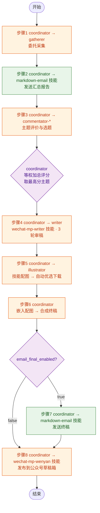

# MP 自动化管线

## 变量定义

| 变量 | 来源 | 说明 |
|------|------|------|
| `{profile}` | `config.json` → `settings.name` | 配置名称，用于区分不同配置的输出目录前缀 |
| `{date}` | 执行日期 | 格式 `yyyyMMdd`，如 `20260616` |
| `{output}` | 输出根目录 | `output/{profile}/{date}` |
| `{topic}` | 步骤 3 选中的主题名称 | 用于输出文件命名，如 `agi_draft.md` |
| `{temp-data}` | 中间数据目录 | `.temp/{profile}/~data` | 非最终产出的中间文件均存放于此 |
| `{temp-scripts}` | 脚本输出目录 | `.temp/{profile}/~scripts` | 运行期脚本均存放于此 |
| `{config-runtime}` | 运行时配置 | `{temp-data}/config.json` | 步骤 1 从原始 config 复制至此，后续统一读取（含 email 字段） |
| `{email}` | 收件地址 | `{config-runtime}` → `settings.email` | coordinator 在步骤 2 和 7 发送邮件时使用 |
| `{email_summary_enabled}` | 汇总邮件开关 | `{config-runtime}` → `settings.email_summary_enabled`，默认 `true` | 设为 `false` 时 coordinator 跳过步骤 2 |
| `{email_final_enabled}` | 终稿邮件开关 | `{config-runtime}` → `settings.email_final_enabled`，默认 `true` | 设为 `false` 时 coordinator 跳过步骤 7 |
| `{wenyan_publish_enabled}` | 发布草稿开关 | `{config-runtime}` → `settings.wenyan_publish_enabled`，默认 `true` | 设为 `false` 时 coordinator 跳过步骤 8 |
| `{wenyan_publish_result}` | 发布结果文件 | `{output}/wenyan-publish-result.json` | 步骤 8 执行结果（成功/失败）写入此文件 |

## 流程图

## 步骤详情

### 步骤 1：抓取与遴选

| | |
|------|------|
| **执行者** | `coordinator` → `gatherer` |
| **说明** | coordinator 将 `config.json` 路径传递给 gatherer，委托其执行采集任务。gatherer 运行技能 `wechat-mp-articles`，完成账号轮选、文章拉取、AI 评分、标签提取、主题遴选全流程，产出汇总报告和主题报告后返回给 coordinator |
| **输入** | `config.json` |
| **输出 (1)** | `{output}/summary_report.md` |
| **输出 (2)** | `{output}/topic_*.md` |

### 步骤 2：发送汇总报告

| | |
|------|------|
| **执行者** | `coordinator`（直接使用 `markdown-email` 技能） |
| **说明** | 先检查 `{email_summary_enabled}`：若为 `false` 则直接跳过。若为 `true`，coordinator 使用技能 `markdown-email` 将 `{output}/summary_report.md` 发送到 `{email}`，邮件标题为 `资讯汇总 - {profile} - {date}` |
| **输入** | `{output}/summary_report.md` |
| **输出** | 已发送的汇总报告邮件；若跳过则无输出 |

### 步骤 3：主题评价与选题

| | |
|------|------|
| **执行者** | `coordinator` → `commentator-*`（5 位评论员独立打分 → coordinator 汇总并机械计算） |
| **说明** | coordinator 将每个 `topic_*.md` 分发给 5 位评论员（`commentator-value`、`commentator-tech`、`commentator-public`、`commentator-academic`、`commentator-ethics`），每位从各自视角独立对每个主题逐维打分（1-5 分）。coordinator 收集全部评分后，按各维度**等权加总**，取总分最高的主题作为最佳选题，输出评价报告和选题决策。coordinator **不参与内容判断**，仅做分数汇总与比较 |
| **输入** | `{output}/topic_*.md` |
| **输出 (1)** | `{output}/commentary.md` — 各主题各维度打分情况（按 `templates/mp-auto-pipeline/template_commentary.md` 渲染） |
| **输出 (2)** | `{output}/selected-topic.md` — 选中的主题、中选理由（得分对比）、相关文章列表含本地路径（按 `templates/mp-auto-pipeline/template_selected-topic.md` 渲染） |

### 步骤 4：撰写与 3 轮审稿（writer 技能）

| | |
|------|------|
| **执行者** | `coordinator` → `writer`（使用 `wechat-mp-writer` 技能） |
| **说明** | coordinator 将 `selected-topic.md`、相关公众号文章路径、`web-search` 补充素材一并传递给 writer，委托其执行 `wechat-mp-writer` 技能。writer 按技能流程完成：阅读素材 → 拟定大纲（按文章类型匹配写作要求）→ 撰写初稿（插入 `[图：图片说明]` 标记）→ **第 1 轮审稿：内容与结构** → 修正 → **第 2 轮审稿：表达与风格** → 修正 → **第 3 轮审稿：调用 proofreader 校对** → 修正（可多次验证直至无误）。输出校对完成的终稿返回 coordinator |
| **输入 (1)** | `{output}/selected-topic.md` — 选题说明与中选理由 |
| **输入 (2)** | 步骤 1 下载的公众号文章原文（`{output}/../*.md`） |
| **输入 (3)** | `web-search` 搜索补充素材的返回结果 |
| **输出** | `{output}/{topic}_proofed.md` — 经过 3 轮审稿校对完成的文章，含 `[图：图片说明]` 标记 |

### 步骤 5：配图（illustrator 技能配图）

| | |
|------|------|
| **执行者** | `coordinator` → `illustrator`（使用 `article-illustrator` 技能） |
| **说明** | coordinator 将 `{topic}_proofed.md` 和输出目录 `{output}` 传递给 illustrator。illustrator 通读全文，解析 `[图：图片说明]` 标记，提取图片数量与说明文字。为每个标记设计结构化 Prompt，调用技能 `article-illustrator`（通过脚本 `scripts/generate_image.js`）。技能内部自动启动双管线（modelscope + pollinations）并行生成，按规则自动优选（ModelScope 优先），下载图片到本地。文件命名格式 `{position}.png`（如 `cover.png`、`inline_1.png`）。每张图片调用一次脚本，返回 JSON 格式生成记录 |
| **输入 (1)** | `{output}/{topic}_proofed.md` — 含 `[图：图片说明]` 标记的文章稿件 |
| **输入 (2)** | `{output}` — 输出根目录，图片文件直接保存至此 |
| **输出 (1)** | 图片文件：`{output}/{position}.png`（如 `{output}/cover.png`、`{output}/inline_1.png`） |
| **输出 (2)** | 生成记录（每张图片执行结果 JSON）：`{ position, scene, prompt, success, local_path, selected_pipeline, attempts[{pipeline, success, error?, size_bytes?}] }` |

### 步骤 6：嵌入配图 → 合成终稿

| | |
|------|------|
| **执行者** | `coordinator`（直接操作，机械替换） |
| **说明** | coordinator 汇总步骤 5 所有图片的生成记录，建立 `position → local_path` 映射表（如 `{ "cover": "output/ai/20260711/cover.png", "inline_1": "output/ai/20260711/inline_1.png" }`）。读取 `{topic}_proofed.md`，遍历文档中的 `[图：图片说明]` 标记，按 `position` 匹配对应图片路径，将每个标记替换为 ``。替换完毕后输出为最终稿件 |
| **输入 (1)** | `{output}/{topic}_proofed.md` — 含 `[图：图片说明]` 标记的文章模板 |
| **输入 (2)** | 生成记录汇总 → `{ position: local_path }` 映射表（由步骤 5 各图片的 JSON 结果合并而来） |
| **输出** | `{output}/{topic}_final.md` — 所有 `[图：...]` 标记已替换为 `` 图片语法的终稿 |

### 步骤 7：发送终稿

| | |
|------|------|
| **执行者** | `coordinator`（直接使用 `markdown-email` 技能） |
| **说明** | 先检查 `{email_final_enabled}`：若为 `false` 则直接跳过。若为 `true`，coordinator 将步骤 6 产出的 `{topic}_final.md` 使用 `markdown-email` 技能发送，邮件标题 `{topic} - {date}` |
| **输入** | `{output}/{topic}_final.md` |
| **输出** | 已发送的终稿邮件；若跳过则无输出 |

### 步骤 8：发布到公众号草稿箱

| | |
|------|------|
| **执行者** | `coordinator` → `wenyan-publish` 技能 |
| **说明** | 先检查 `{wenyan_publish_enabled}`：若为 `false` 则直接跳过。若为 `true`，coordinator 使用技能 `wenyan-publish` 将 `{output}/{topic}_final.md` 发布到微信公众号草稿箱。执行结果（成功/失败）写入 `{output}/wenyan-publish-result.json`（脚本通过 `{output.result}` 参数接收），不阻塞管线结束 |
| **输入** | `{output}/{topic}_final.md` |
| **输出** | `{wenyan_publish_result}` — 执行结果（成功/失败）；若跳过则无输出 |
