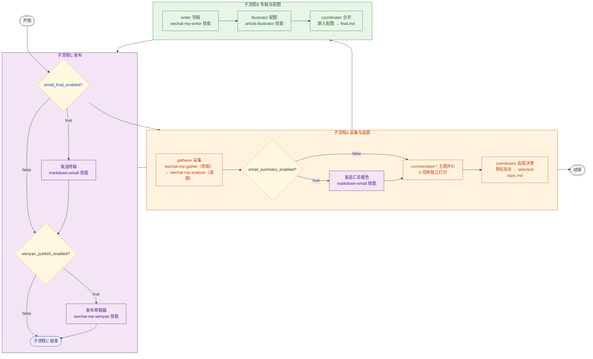

# MP 自动化管线

## 变量定义

| 变量 | 来源 | 说明 |
|------|------|------|
| `{config}` | 输入参数 | 配置文件路径，如 `configs/ai-config.json` |
| `{profile}` | `{config}` → `settings.name` | 配置名称，用于区分输出目录前缀 |
| `{date}` | 执行日期 | 格式 `yyyyMMdd` |
| `{output}` | 自动拼接 | `output/{profile}/{date}`，所有产物均写入此目录 |
| `{topic}` | 子流程 A 产出 | 选中的主题名称，用于文件命名 |
| `{temp}/data` | 中间数据目录 | `.temp/{profile}/data`，非最终产出的中间文件存放于此 |
| `{config-runtime}` | 步骤 1 产出 | `{temp}/data/config.json`，运行时配置副本（含 email 字段） |
| `{knowledge-local}` | `{config-runtime}` → `settings.knowledge-local`，默认 `.knowledge/{profile}` | 本地知识库根目录，文章下载至 `{knowledge-local}/mp_articles/` |
| `{knowledge-remote}` | 输入参数（可选，预留） | 远程知识库接口，与 `{knowledge-local}` 并列 |
| `{email}` | `{config-runtime}` → `settings.email` | 收件地址 |
| `{email_summary_enabled}` | `{config-runtime}` → `settings.email_summary_enabled` | 汇总邮件开关，默认 `true` |
| `{email_final_enabled}` | `{config-runtime}` → `settings.email_final_enabled` | 终稿邮件开关，默认 `true` |
| `{wenyan_publish_enabled}` | `{config-runtime}` → `settings.wenyan_publish_enabled` | 发布草稿开关，默认 `true` |
| `{wenyan_publish_result}` | 子流程 C 产出 | `{output}/wenyan-publish-result.json` |

## 流程图



## 步骤详情

### 步骤 1：加载配置

| | |
|------|------|
| **执行者** | `coordinator` |
| **说明** | 读取 `{config}`，解析账号配置、开关设置、邮件地址等。确定 `{knowledge-local}`（优先取 `settings.knowledge-local`，默认 `.knowledge/{profile}`）。复制为运行时配置 `{config-runtime}`。初始化输出目录 `{output}`、中间数据目录 `{temp}/data`、知识库目录 `{knowledge-local}/mp_articles/` |
| **输入** | `{config}` — 配置文件路径 |
| **输出** | `{config-runtime}` — 运行时配置，所有子流程统一从此读取参数 |

### 子流程 A：采集与选题

**目标**：从公众号抓取文章 → 评价打分 → 选出最佳主题

| 节点 | 执行者 | 说明 | 输入 | 输出 |
|------|--------|------|------|------|
| **A1 采集** | `coordinator` → `gatherer` | gatherer 先运行 `wechat-mp-gather`（抓取：账号轮选、文章拉取、下载），再运行 `wechat-mp-analyze`（选题：AI 评分、标签提取、主题遴选、报告生成） | `{config}` | `{output}/summary_report.md`、`{output}/topic_*.md` |
| **A2 汇总邮件** | `coordinator`（`markdown-email` 技能） | 检查 `{email_summary_enabled}`，为 `true` 时将 `summary_report.md` 发送到 `{email}`，标题 `资讯汇总 - {profile} - {date}` | `{output}/summary_report.md` | 已发送邮件；若跳过则无输出 |
| **A3 主题评价** | `coordinator` → `commentator-*` | 5 位评论员（value/tech/public/academic/ethics）从各自视角独立对每个主题打分（1-5 分） | `{output}/topic_*.md` | `{output}/commentary.md` — 各主题各维度打分 |
| **A4 选题决策** | `coordinator` | 收集评分，等权加总，取最高分主题。输出选题决策和该主题对应文章路径 | `{output}/commentary.md` | `{output}/selected-topic.md` — 中选主题、得分对比、相关文章列表 |

**产出传递**：
- `{output}/selected-topic.md` → 子流程 B
- `{knowledge-local}/mp_articles/` → 子流程 B（含已下载的公众号原文）

### 子流程 B：写稿与配图

**目标**：根据选题撰写文章、生成配图、合并为终稿

| 节点 | 执行者 | 说明 | 输入 | 输出 |
|------|--------|------|------|------|
| **B1 写稿** | `coordinator` → `writer` | writer 执行 `wechat-mp-writer` 技能：阅读素材（`{knowledge-local}/mp_articles/` 和/或 `{knowledge-remote}`）→ 拟定大纲 → 撰写初稿（frontmatter `title` + `[图：图片说明]` 标记）→ 3 轮审稿 | `{output}/selected-topic.md`、知识库参数 | `{output}/{topic}_proofed.md` — 含 `[图]` 标记的校对终稿 |
| **B2 配图** | `coordinator` → `illustrator` | illustrator 通读 `{topic}_proofed.md`，解析 `[图]` 标记，对每张配图调用 `article-illustrator` 技能（双管线并行生成、自动优选、下载到本地） | `{output}/{topic}_proofed.md`、`{output}` | 图片文件 `{output}/{position}.png`、生成记录列表 |
| **B3 合并** | `coordinator` | 建立 `position → local_path` 映射，遍历 `{topic}_proofed.md` 将 `[图：图片说明]` 替换为 ``；配图失败的标记保留原样 | `{output}/{topic}_proofed.md`、生成记录 | `{output}/{topic}_final.md` — 图片嵌入完毕的终稿 |

### 子流程 C：发布

**目标**：将终稿通过邮件发送和/或发布到公众号草稿箱

| 节点 | 执行者 | 说明 | 输入 | 输出 |
|------|--------|------|------|------|
| **C1 终稿邮件** | `coordinator`（`markdown-email` 技能） | 检查 `{email_final_enabled}`，为 `true` 时将 `{topic}_final.md` 发送到 `{email}`，标题 `{topic} - {date}` | `{output}/{topic}_final.md` | 已发送邮件；若跳过则无输出 |
| **C2 发布草稿箱** | `coordinator` → `wechat-mp-wenyan` 技能 | 检查 `{wenyan_publish_enabled}`，为 `true` 时将 `{topic}_final.md` 发布到公众号草稿箱。结果写入 `{wenyan_publish_result}` | `{output}/{topic}_final.md` | `{wenyan_publish_result}` — 发布结果（成功/失败）；若跳过则无输出 |

## 子流程间数据流

```
步骤1 ──→ {config-runtime} ──→ 子流程A ──→ 子流程B ──→ 子流程C
                                              ↑
                  {knowledge-local}/mp_articles ─┘
```

| 传递链 | 说明 |
|--------|------|
| 步骤 1 → A | `{config-runtime}`（开关、邮件、账号等）、`{knowledge-local}`（知识库根目录） |
| A → B | `{output}/selected-topic.md`（选题）、`{knowledge-local}/mp_articles/`（公众号原文） |
| B → C | `{output}/{topic}_final.md`（终稿） |
