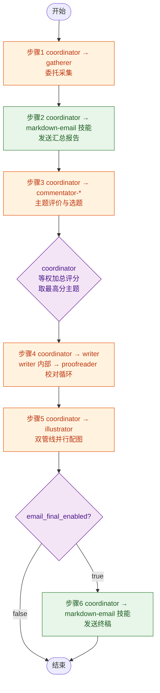

# MP 自动化管线

## 变量定义

| 变量 | 来源 | 说明 |
|------|------|------|
| `{profile}` | `config.json` → `settings.name` | 配置名称，用于区分不同配置的输出目录前缀 |
| `{date}` | 执行日期 | 格式 `yyyyMMdd`，如 `20260616` |
| `{output}` | 输出根目录 | `output/{profile}/{date}` |
| `{topic}` | 步骤 3 选中的主题名称 | 用于输出文件命名，如 `agi_draft.md` |
| `{temp-data}` | 中间数据目录 | `.temp/{profile}/~data` | 非最终产出的中间文件均存放于此 |
| `{temp-scripts}` | 脚本输出目录 | `.temp/{profile}/~scripts` | 运行期脚本均存放于此 |
| `{config-runtime}` | 运行时配置 | `{temp-data}/config.json` | 步骤 1 从原始 config 复制至此，后续统一读取（含 email 字段） |
| `{email}` | 收件地址 | `{config-runtime}` → `settings.email` | coordinator 在步骤 2 和 6 发送邮件时使用 |
| `{email_summary_enabled}` | 汇总邮件开关 | `{config-runtime}` → `settings.email_summary_enabled`，默认 `true` | 设为 `false` 时 coordinator 跳过步骤 2 |
| `{email_final_enabled}` | 终稿邮件开关 | `{config-runtime}` → `settings.email_final_enabled`，默认 `true` | 设为 `false` 时 coordinator 跳过步骤 6 |

## 流程图

## 步骤详情

### 步骤 1：抓取与遴选

| | |
|------|------|
| **执行者** | `coordinator` → `gatherer` |
| **说明** | coordinator 将 `config.json` 路径传递给 gatherer，委托其执行采集任务。gatherer 运行技能 `wechat-mp-articles`，完成账号轮选、文章拉取、AI 评分、标签提取、主题遴选全流程，产出汇总报告和主题报告后返回给 coordinator |
| **输入** | `config.json` |
| **输出 (1)** | `{output}/summary_report.md` |
| **输出 (2)** | `{output}/topic_*.md` |

### 步骤 2：发送汇总报告

| | |
|------|------|
| **执行者** | `coordinator`（直接使用 `markdown-email` 技能） |
| **说明** | 先检查 `{email_summary_enabled}`：若为 `false` 则直接跳过。若为 `true`，coordinator 使用技能 `markdown-email` 将 `{output}/summary_report.md` 发送到 `{email}`，邮件标题为 `资讯汇总 - {profile} - {date}` |
| **输入** | `{output}/summary_report.md` |
| **输出** | 已发送的汇总报告邮件；若跳过则无输出 |

### 步骤 3：主题评价与选题

| | |
|------|------|
| **执行者** | `coordinator` → `commentator-*`（5 位评论员独立打分 → coordinator 汇总并机械计算） |
| **说明** | coordinator 将每个 `topic_*.md` 分发给 5 位评论员（`commentator-value`、`commentator-tech`、`commentator-public`、`commentator-academic`、`commentator-ethics`），每位从各自视角独立对每个主题逐维打分（1-5 分）。coordinator 收集全部评分后，按各维度**等权加总**，取总分最高的主题作为最佳选题，输出评价报告和选题决策。coordinator **不参与内容判断**，仅做分数汇总与比较 |
| **输入** | `{output}/topic_*.md` |
| **输出 (1)** | `{output}/commentary.md` — 各主题各维度打分情况（按 `templates/mp-auto-pipeline/template_commentary.md` 渲染） |
| **输出 (2)** | `{output}/selected-topic.md` — 选中的主题、中选理由（得分对比）、相关文章列表含本地路径（按 `templates/mp-auto-pipeline/template_selected-topic.md` 渲染） |

### 步骤 4：撰写与校对

| | |
|------|------|
| **执行者** | `coordinator` → `writer`（writer 内部 task 调用 `proofreader` 完成校对循环） |
| **说明** | coordinator 将 `selected-topic.md`、相关公众号文章路径、`web-search` 补充素材一并传递给 writer，委托其完成文章撰写。writer 独立完成：阅读素材 → 拟定大纲 → 编写正文 → 插入 `[图：图片说明]` 标记。配图数量：封面 1 张 + 文中标记严格控制在 **2-3 张**。图片说明文字须满足 **30-120 字**。完成后 writer 通过 task 调用 proofreader 审查；proofreader 检出敏感词/错别字/语法/逻辑/图片说明字数问题后返回清单；writer 逐条修正后再次调用 proofreader 验证，循环至无问题。最终终稿返回给 coordinator |
| **输入 (1)** | `{output}/selected-topic.md` |
| **输入 (2)** | 步骤 1 下载的公众号文章原文（`{output}/../*.md`） |
| **输入 (3)** | `web-search` 搜索补充素材的返回结果 |
| **输出** | `{output}/{topic}_proofed.md` |

### 步骤 5：配图（双管线并行）

| | |
|------|------|
| **执行者** | `coordinator` → `illustrator` |
| **说明** | coordinator 将 `{topic}_proofed.md` 传递给 illustrator，委托其根据 `[图：图片说明]` 标记生成配图。illustrator 同时启动两条独立管线：管线 A 使用 `image-generation-modelscope`，管线 B 使用 `image-generation-pollinations`，互不等待。每条管线独立生成封面首图与 **1-2 张**文中配图并嵌入文章，输出两份完整的独立稿件。ModelScope 管线失败时保留无图占位，不影响 Pollinations 管线继续执行。完成后两份稿件返回给 coordinator |
| **输入** | `{output}/{topic}_proofed.md` |
| **输出 (1)** | `{output}/{topic}_modelscope_final.md` — ModelScope 管线产出 |
| **输出 (2)** | `{output}/{topic}_pollinations_final.md` — Pollinations 管线产出 |

### 步骤 6：发送终稿

| | |
|------|------|
| **执行者** | `coordinator`（直接使用 `markdown-email` 技能） |
| **说明** | 先检查 `{email_final_enabled}`：若为 `false` 则直接跳过。若为 `true`，coordinator 从两份终稿中**选择 1 篇**发送：优先使用 `{topic}_modelscope_final.md`（检查其中是否存在 `** | `{output}/{topic}_modelscope_final.md` |
| **输入 (2)** | `{output}/{topic}_pollinations_final.md` |
| **输出** | 已发送的终稿邮件；若跳过则无输出 |
