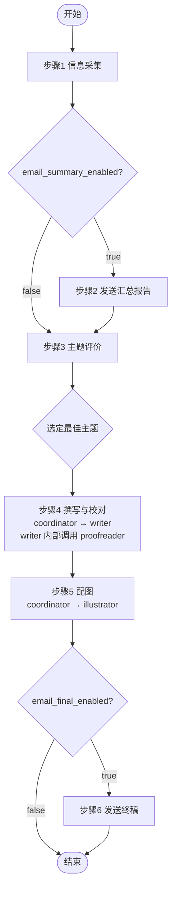

# MP 自动化管线

## 变量定义

| 变量 | 来源 | 说明 |
|------|------|------|
| `{profile}` | `config.json` → `settings.name` | 配置名称，用于区分不同配置的输出目录前缀 |
| `{date}` | 执行日期 | 格式 `yyyyMMdd`，如 `20260616` |
| `{output}` | 输出根目录 | `output/{profile}/{date}` |
| `{topic}` | 步骤 3 选中的主题名称 | 用于输出文件命名，如 `agi_draft.md` |
| `{temp-data}` | 中间数据目录 | `.temp/{profile}/~data` | 非最终产出的中间文件均存放于此 |
| `{temp-scripts}` | 脚本输出目录 | `.temp/{profile}/~scripts` | 运行期脚本均存放于此 |
| `{config-runtime}` | 运行时配置 | `{temp-data}/config.json` | 步骤 1 从原始 config 复制至此，后续统一读取（含 email 字段） |
| `{email}` | 收件地址 | `{config-runtime}` → `settings.email` | 步骤 2 发送汇总报告、步骤 7 发送终稿的目标邮箱 |
| `{email_summary_enabled}` | 汇总邮件开关 | `{config-runtime}` → `settings.email_summary_enabled`，默认 `true` | 设为 `false` 时跳过步骤 2（汇总报告发送） |
| `{email_final_enabled}` | 终稿邮件开关 | `{config-runtime}` → `settings.email_final_enabled`，默认 `true` | 设为 `false` 时跳过步骤 7（终稿发送） |

## 流程图

## 步骤详情

### 步骤 1：抓取与遴选

| | |
|------|------|
| **执行者** | `coordinator` → `gatherer` |
| **说明** | coordinator 调用 gatherer，gatherer 根据 `config.json` 使用技能 `wechat-mp-articles` 抓取公众号文章，生成汇总报告和 AI 遴选主题 |
| **输入** | `config.json` |
| **输出 (1)** | `{output}/summary_report.md` |
| **输出 (2)** | `{output}/topic_*.md` |

### 步骤 2：发送汇总报告

| | |
|------|------|
| **执行者** | `coordinator` |
| **说明** | 先检查 `{email_summary_enabled}`：若为 `false` 则直接跳过本步骤，不发送任何邮件。若为 `true`，使用技能 `markdown-email` 将 `{output}/summary_report.md` 发送到 `{email}`，邮件标题为 `资讯汇总 - {profile} - {date}` |
| **输入** | `{output}/summary_report.md` |
| **输出** | 已发送的汇总报告邮件（标题：`资讯汇总 - {profile} - {date}`）；若跳过则无输出 |

### 步骤 3：主题评价

| | |
|------|------|
| **执行者** | `coordinator` → `commentator-*` |
| **说明** | coordinator 调用 5 位独立评论员对遴选主题逐维打分，收集评分后选定最佳主题 |
| **输入** | `{output}/topic_*.md` |
| **输出 (1)** | `{output}/commentary.md` — 各主题打分情况（按 `templates/mp-auto-pipeline/template_commentary.md` 渲染） |
| **输出 (2)** | `{output}/selected-topic.md` — 选中的主题、中选理由、相关文章列表含本地路径（按 `templates/mp-auto-pipeline/template_selected-topic.md` 渲染） |

### 步骤 4：撰写与校对

| | |
|------|------|
| **执行者** | `coordinator` → `writer`（writer 内部调用 `proofreader` 完成校对循环） |
| **说明** | coordinator 将选中主题及相关素材传递给 writer。writer 按需 `web-search` 补充素材，编写公众号文章，在关键位置（数据对比、流程示意、核心观点可视化）插入 `[图：图片说明]` 标记。配图数量：封面 1 张 + 文中标记严格控制在 **1-2 张**。图片说明文字须满足 **30-120 字**（不少于 30 字确保画面要素完整，不超过 120 字避免冗余），writer 在撰写时自行提炼核心描述。然后通过 task 调用 proofreader 进行本轮校对。proofreader 检查敏感词、错别字、语法、逻辑及图片说明字数后返回问题清单，writer 逐条修正，迭代至 proofreader 确认无误。最后 writer 返回校对完成的终稿给 coordinator |
| **输入 (1)** | `{output}/selected-topic.md` |
| **输入 (2)** | 步骤 1 下载的公众号文章原文（`{output}/../*.md`） |
| **输入 (3)** | `web-search` 搜索补充素材的返回结果 |
| **输出** | `{output}/{topic}_proofed.md` |

### 步骤 5：配图（双管线并行）

| | |
|------|------|
| **执行者** | `coordinator` → `illustrator` |
| **说明** | illustrator 根据文章中 `[图：图片说明]` 标记，同时启动 **两条独立管线**并行配图——管线 A 使用 MCP `image-generation-modelscope`，管线 B 使用 MCP `image-generation-pollinations`，互不等待。每条管线独立生成封面首图与 **1-2 张**文中配图并嵌入文章，最终输出两份完整的独立稿件。ModelScope 管线失败时保留无图占位，不影响 Pollinations 管线继续执行 |
| **输入** | `{output}/{topic}_proofed.md` |
| **输出 (1)** | `{output}/{topic}_modelscope_final.md` — ModelScope 管线产出 |
| **输出 (2)** | `{output}/{topic}_pollinations_final.md` — Pollinations 管线产出 |

### 步骤 6：发送终稿

| | |
|------|------|
| **执行者** | `coordinator` |
| **说明** | 先检查 `{email_final_enabled}`：若为 `false` 则直接跳过本步骤，不发送任何邮件。若为 `true`，从两份终稿中**选择 1 篇**发送：优先使用 `{topic}_modelscope_final.md`（检查其中是否存在 `** | `{output}/{topic}_modelscope_final.md` |
| **输入 (2)** | `{output}/{topic}_pollinations_final.md` |
| **输出** | 已发送的终稿邮件（标题：`{topic} - {date}`）；若跳过则无输出 |
