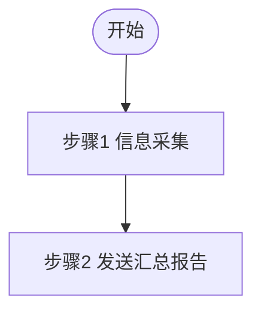

# MP 采集简报管线

## 变量定义

| 变量 | 来源 | 说明 |
|------|------|------|
| `{profile}` | `config.json` → `settings.name` | 配置名称，用于区分不同配置的输出目录前缀 |
| `{date}` | 执行日期 | 格式 `yyyyMMdd`，如 `20260616` |
| `{output}` | 输出根目录 | `output/{profile}/{date}` |
| `{config-runtime}` | 运行时配置 | `.temp/{profile}/~data/config.json` | 步骤 1 从原始 config 复制至此，后续统一读取（含 email 字段） |
| `{email}` | 收件地址 | `{config-runtime}` → `settings.email` | 步骤 2 发送汇总报告的目标邮箱 |

## 流程图

## 步骤详情

### 步骤 1：抓取与遴选

| | |
|------|------|
| **执行者** | `gatherer` |
| **说明** | 根据 `config.json` 使用技能 `wechat-mp-articles` 抓取公众号文章，生成汇总报告和 AI 遴选主题 |
| **输入** | `config.json` |
| **输出 (1)** | `{output}/summary_report.md` |
| **输出 (2)** | `{output}/topic_*.md` |

### 步骤 2：发送汇总报告

| | |
|------|------|
| **执行者** | `writer` |
| **说明** | 使用技能 `markdown-email` 将 `{output}/summary_report.md` 发送到 `{email}`，邮件标题为 `资讯汇总 - {profile} - {date}` |
| **输入** | `{output}/summary_report.md` |
| **输出** | 已发送的汇总报告邮件（标题：`资讯汇总 - {profile} - {date}`） |
