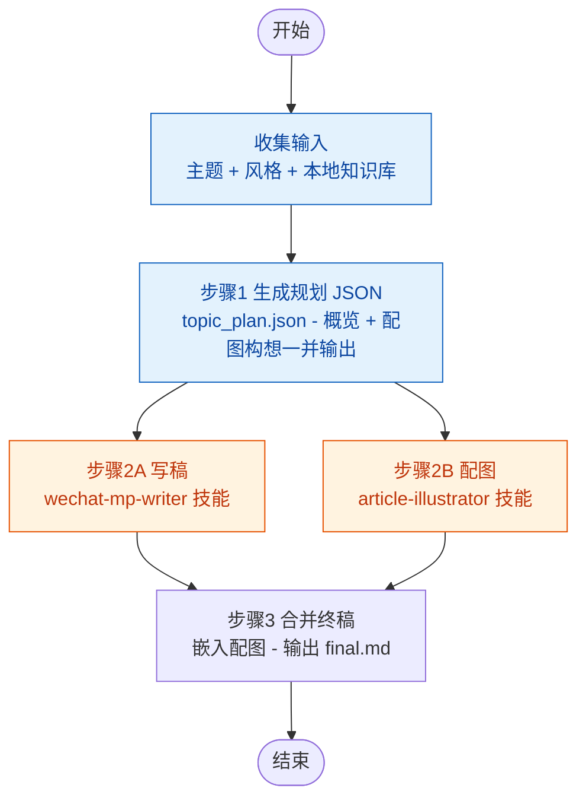

# 写稿·配图 流程

## 变量定义

| 变量 | 来源 | 说明 |
|------|------|------|
| `{topic}` | 输入参数 | 写作主题，如 `大模型行业趋势` |
| `{style}` | 输入参数 | 文章风格/模板，可选：`资讯快评` / `技术解读` / `行业分析` / `深度观点` / `轻松科普` |
| `{knowledge-local}` | 输入参数（可选） | 本地知识库目录。与 `{knowledge-remote}` 并列，至少提供一个 |
| `{output}` | 输入参数 | 完整输出路径，由调用者指定（如 `output/test/20260713`），所有产物均写入此目录 |
| `{topic_plan}` | 自动拼接 | `{output}/{topic}_plan.json` — 步骤 1 产出的 JSON 规划文件 |
| `{knowledge-remote}` | 输入参数（可选，预留） | 远程知识库接口。与 `{knowledge-local}` 并列，至少提供一个 |

## 流程图



## 步骤详情

### 步骤 0：收集输入

| | |
|------|------|
| **执行者** | 调用者（用户或上级编排器） |
| **说明** | 收集参数。必须项：`{topic}`（主题）、`{style}`（文章风格）、`{output}`（输出路径）。可选项：知识库参数（`{knowledge-local}` 和/或 `{knowledge-remote}`，至少提供一个）。调用者确保 `{output}` 目录已创建 |
| **输入** | 调用者提供的参数 |
| **输出** | `{output}` 目录已就绪 |

### 步骤 1：生成规划 JSON

| | |
|------|------|
| **执行者** | `coordinator` |
| **说明** | coordinator 读取知识库素材（`{knowledge-local}` 和/或 `{knowledge-remote}`），结合 `{topic}` 与 `{style}`，输出一份 JSON 规划文件，包含主题概览和配图构想。JSON 固定结构见下方模板 |
| **输入 (1)** | `{topic}` — 写作主题 |
| **输入 (2)** | `{style}` — 文章风格 |
| **输入 (3)** | 知识库参数（`{knowledge-local}` 和/或 `{knowledge-remote}`） |
| **输出** | `{topic_plan}` — JSON 规划文件，结构如下 |

```json
{
  "topic": "主题名称",
  "style": "文章风格",
  "overview": {
    "background": "主题背景",
    "core_thesis": "核心论点",
    "article_structure": ["开篇段落", "分段 1", "分段 2", "结尾"],
    "target_audience": "目标读者定位",
    "references": ["参考素材 1", "参考素材 2"]
  },
  "illustrations": [
    {
      "position": "cover",
      "scene": "wechat-cover",
      "description": "图片说明（30-120 字）",
      "prompt": "Prompt 设计方向"
    },
    {
      "position": "inline_1",
      "scene": "article-inline",
      "description": "图片说明（30-120 字）",
      "prompt": "Prompt 设计方向"
    }
  ]
}
```

### 步骤 2：并行写稿与配图

#### 步骤 2A：写稿（wechat-mp-writer 技能）

| | |
|------|------|
| **执行者** | `coordinator` → `writer` |
| **说明** | coordinator 将 `{topic_plan}`、知识库参数（`{knowledge-local}` 和/或 `{knowledge-remote}`）、输出目录传递 writer。writer 执行 `wechat-mp-writer` 技能完成撰写与审稿，输出 `{output}/{topic}_proofed.md` |
| **输入 (1)** | `{topic_plan}` — JSON 规划文件 |
| **输入 (2)** | 知识库参数（`{knowledge-local}` 和/或 `{knowledge-remote}`） |
| **输入 (3)** | `{output}` — 输出目录 |
| **输出** | `{output}/{topic}_proofed.md` — 含 `[图：图片说明]` 标记的校对终稿 |

#### 步骤 2B：配图（article-illustrator 技能）

| | |
|------|------|
| **执行者** | `coordinator` → `illustrator` |
| **说明** | coordinator 将 `{topic_plan}` 传递给 illustrator。illustrator 解析 JSON 中 `illustrations` 数组，对每张配图调用 `article-illustrator` 技能：通过脚本 `generate_image.js` 启动双管线（ModelScope + Pollinations）并行生成，自动优选，下载到 `{output}/{position}.png` |
| **输入 (1)** | `{topic_plan}` — JSON 规划文件（`illustrations` 数组定义每张配图） |
| **输入 (2)** | `{output}` — 图片保存目录 |
| **输出 (1)** | 图片文件：`{output}/{position}.png` |
| **输出 (2)** | 生成记录列表：`[{ position, scene, prompt, success, local_path, selected_pipeline }]` |

### 步骤 3：合并终稿

| | |
|------|------|
| **执行者** | `coordinator`（直接操作，机械替换） |
| **说明** | coordinator 建立 `position → local_path` 映射表。读取 `{topic}_proofed.md`，遍历文档中的 `[图：图片说明]` 标记，按 `position` 匹配对应图片路径，替换为 ``。配图失败的标记保留原样（`[图：图片说明]`），不阻塞流程 |
| **输入 (1)** | `{output}/{topic}_proofed.md` — 含 `[图]` 标记的文章 |
| **输入 (2)** | 生成记录 → `{ position: local_path }` 映射表 |
| **输出** | `{output}/{topic}_final.md` — 图片嵌入完毕的终稿 |

## 与完整管线的区别

| 维度 | 完整管线 (mp-auto-pipeline) | 本流程 (mp-write) |
|------|---------------------------|--------------------|
| 起点 | 公众号抓取 → 汇总 → 评价 → 选题 | 直接输入主题 + 风格 + 知识库 |
| 步骤 1 | 生成 JSON 规划（概览 + 配图构想） | 同左（但产物更精简，单文件 JSON 固定结构） |
| 步骤 2 | 写稿（含 3 轮审稿）+ 配图并行 | 同左 |
| 步骤 3 | 合并终稿 | 同左 |
| 步骤 4-8 | 发送汇总报告 → 评价 → 写稿 → 配图 → 发布 | 无（纯写稿配图，不含采集和发布） |
| 适用场景 | 端到端全自动管线 | 已有主题/素材，只需写稿配图 |
